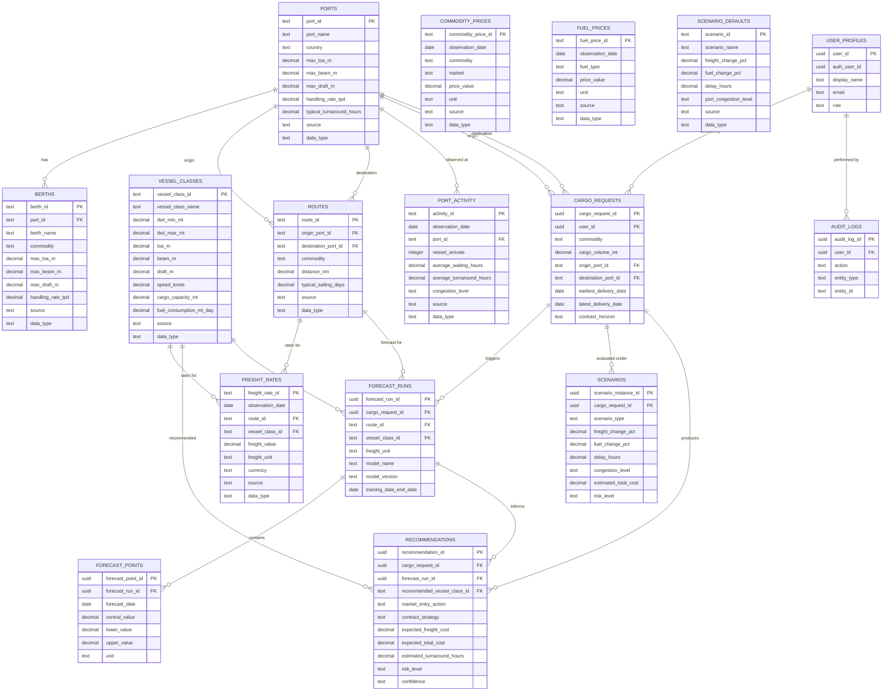

# Data Dictionary — DockTech V1

## Document Purpose

This document is the frozen canonical data contract for DockTech V1. It defines every dataset, column, relationship, unit, controlled vocabulary, feasibility rule, cost calculation formula, data grain, and validation standard that the V1 system relies on.

All backend services, forecasting pipelines, feasibility engines, cost/scenario engines, database schemas, and frontend interfaces must treat this document as the authoritative specification. If any implementation code disagrees with this document, the code must be aligned to this document.

### Audience

- Backend / FastAPI developers
- ML / forecasting engineers
- Vessel–port feasibility engineers
- Cost and scenario engine developers
- Frontend / React developers
- Database / Supabase developers
- Team lead during integration and code review

### Scope

This document covers:
- **9 reference datasets** (CSV seed files for Supabase PostgreSQL)
- **7 application-generated tables** (managed in Supabase PostgreSQL at runtime)
- **Vessel, berth, and port feasibility rules** (two-ended constraint logic)
- **Cost and turnaround calculation semantics** (frozen V1 multi-voyage formulas)
- **Domain referential integrity rules** (Cargo Request → Route, Forecast Run → Recommendation)
- **Controlled vocabularies and canonical units**
- **Entity relationships and foreign keys**
- **Data grain definitions and uniqueness guarantees**
- **Synthetic data rules and provenance standards**
- **Data quality, validation, and failure-safe rules**
- **Database implementation guidance (Supabase PostgreSQL)**
- **Feature traceability and V1 boundaries**

This document explicitly does **not** contain:
- Executable SQL DDL or migration scripts
- Python, TypeScript, or FastAPI application code
- Mock CSV data records
- Supabase project configuration files

---

## V1 Data Philosophy & Foundational Rules

1. **V1 uses representative synthetic data.** All reference datasets are generated for system demonstration, algorithm validation, and SIH prototype evaluation.
2. **Synthetic data must never create false authority.** Even when port or vessel names reflect real-world entities, all constraints, berth limits, handling rates, turnaround assumptions, route distances, sailing times, freight rates, commodity prices, fuel prices, and congestion values are synthetic planning inputs.
   - Route distances are approximate plausibility targets only and are **not** verified hydrographic, navigational, or commercial voyage measurements.
   - The UI and API must explicitly label synthetic data as `SYNTHETIC`.
   - Never present values as official or certified (e.g., do not say *"Paradip official max draft = 14.5m"*; state *"DockTech V1 synthetic planning constraint: 14.5m"*).
3. **Every reference record carries provenance metadata.** The `source` and `data_type` fields track where data originated and whether it is synthetic, proxy, actual, or estimated. In V1 seed CSVs, all reference records set `source = 'SYNTHETIC_GENERATOR_V1'` and `data_type = 'SYNTHETIC'`.
4. **Units are mandatory and explicit.** No numeric value is stored without an associated unit. Incompatible units are never mixed within the same column or observation series.
5. **Standardized date and timestamp formats.** All dates use ISO 8601 `YYYY-MM-DD`. Timestamps use ISO 8601 UTC format `YYYY-MM-DDTHH:MM:SSZ`.
6. **Stable, immutable identifiers.** Reference datasets use stable text identifiers (e.g., `PARADIP`, `PANAMAX`, `NEWCASTLE_PARADIP_THERMAL`). Application tables use UUID v4. Relationships rely strictly on ID foreign keys, never on display names.
7. **Referential integrity across all entities.** Every foreign key points to a valid, uniquely identified record in the target table. Domain integrity rules govern derived associations (such as Cargo Request resolving to a Route).
8. **Freight unit consistency: One forecast run = One freight unit.** A forecast run and its forecast points must adhere to exactly one freight unit (`USD_PER_MT` or `USD_PER_DAY`).
9. **Null and missing data policy:**
   - Required reference fields in seed CSVs must **never** be NULL or blank.
   - If time-series observations are missing, the system must not silently invent numbers. Missing data must be handled through explicit documented interpolation or rejected with a structured error.
10. **Failure-safe architecture:** When reference data, routes, compatible berths, or historical series are unavailable or contradictory, the system must **fail safely** with a structured domain error rather than hallucinating compatibility, forecasts, or recommendations.
11. **Percentages are stored as face values.** 5% is stored as `5.0` (not `0.05`). A 10% increase is `10.0`; a 5% decrease is `-5.0`.
12. **Extensible schema, focused V1 scope.** Fields without an immediate V1 consumer are excluded. Future features extend the schema via new tables or documented versioning rather than overloading V1 entities.

---

## V1 Geographic Coverage & Route Roles

### Scope Distinction: Representative Expanded Coverage vs. Real-World Scope

The PRD defines the core MVP problem statement around bulk cargo routes into India's East Coast (specifically SAIL procurement trade lanes). In V1, we implement a **representative expanded synthetic coverage** covering 8 origin ports across 4 exporting nations and 7 destination ports on the East Coast of India.

> [!NOTE]
> This expanded coverage provides diverse geographic, navigational, and port constraint combinations for robust scenario modeling. It does **not** purport to cover all global ports, all Indian terminals, or all coal grades in the real world.

### Origin Ports (Loading Ports)

| Port ID | Port Name | Country | Geographic Region |
|---|---|---|---|
| `NEWCASTLE` | Newcastle | Australia | Oceania / Pacific |
| `GLADSTONE` | Gladstone | Australia | Oceania / Pacific |
| `HAMPTON_ROADS` | Hampton Roads | USA | North America / Atlantic |
| `BALTIMORE` | Baltimore | USA | North America / Atlantic |
| `MAPUTO` | Maputo | Mozambique | East Africa / Indian Ocean |
| `NACALA` | Nacala | Mozambique | East Africa / Indian Ocean |
| `TABONEO` | Taboneo | Indonesia | Southeast Asia / Pacific |
| `SAMARINDA` | Samarinda | Indonesia | Southeast Asia / Pacific |

### Destination Ports (Discharge Ports — India East Coast)

| Port ID | Port Name | Country | Geographic Region |
|---|---|---|---|
| `PARADIP` | Paradip | India | East Coast India (Odisha) |
| `VISAKHAPATNAM` | Visakhapatnam | India | East Coast India (Andhra Pradesh) |
| `GANGAVARAM` | Gangavaram | India | East Coast India (Andhra Pradesh) |
| `GOPALPUR` | Gopalpur | India | East Coast India (Odisha) |
| `DHAMRA` | Dhamra | India | East Coast India (Odisha) |
| `SAGAR_SANDHEADS` | Sagar-Sandheads | India | East Coast India (West Bengal anchorage) |
| `HALDIA` | Haldia | India | East Coast India (West Bengal dock) |

### Origin and Destination Port Role Semantics

`ports.csv` contains all ports — both international loading ports and Indian discharge ports.

**Architectural Decision on Port Role:**
- We do **not** add a redundant `port_type` or `port_role` column to `ports.csv`.
- Adding a static `port_role` column would artificially restrict ports that could serve dual functions in future extensions and create data redundancy.
- **Canonical Rule:** A port's role is established by how it is referenced in `routes.csv` and `cargo_requests`:
  - `routes.origin_port_id` canonically defines a loading/origin port for that trade lane.
  - `routes.destination_port_id` canonically defines a discharge/destination port for that trade lane.
- Seed data validation rules enforce that in V1:
  - All `routes.origin_port_id` entries belong to overseas ports (`country != 'India'`).
  - All `routes.destination_port_id` entries belong to Indian East Coast ports (`country == 'India'`).

---

## Vessel, Berth, and Port Feasibility Logic

Vessel–port feasibility is a cornerstone of the DockTech platform. A vessel class cannot be recommended or evaluated for cost unless it passes physical and commodity feasibility.

### Three Distinct Feasibility Concepts

1. **Port Feasibility (Planning Envelope / Screening Layer):**
   - Represents the general, macro-level planning limits of a port (`ports.max_loa_m`, `ports.max_beam_m`, `ports.max_draft_m`).
   - Serves as an early screening layer.
   - **Crucial Rule:** Port-level feasibility does **not** guarantee berth feasibility. A vessel that fits within the port's general maximum draft may still be unable to berth if all berths handling that commodity have shallower draft limits.
2. **Berth Feasibility (Authoritative Operational Layer):**
   - Represents the actual physical constraints (`berths.max_loa_m`, `berths.max_beam_m`, `berths.max_draft_m`) and commodity specialization (`berths.commodity`) of specific terminal berths.
   - When berth records exist, **berth-level constraints are authoritative**.
3. **Vessel Feasibility (Operational Compatibility):**
   - A vessel is operationally feasible for a cargo request if and only if it is compatible with both the origin loading port and the destination discharge port at the berth level for the specified commodity.

### Two-Ended Feasibility Requirement

Feasibility must occur at **both ends** of the voyage:
$$\text{Feasible} = \text{Feasible}_{\text{Origin}} \land \text{Feasible}_{\text{Destination}}$$

A vessel class that can load at Newcastle but cannot discharge at Haldia due to draft restrictions is **strictly infeasible** for that cargo request.

### Formal V1 Feasibility Evaluation Sequence

When evaluating a `cargo_request` with origin $P_{orig}$, destination $P_{dest}$, commodity $C$, and parcel volume $V$:

1. **Resolve Route:** Match $(P_{orig}, P_{dest}, C)$ in `routes.csv`. If no matching route exists, **fail safely** and return `ERROR_ROUTE_NOT_FOUND`.
2. **Identify Candidate Origin Berths:** Query `berths.csv` where `port_id == P_{orig}` AND `commodity == C`.
   - If zero berths match commodity $C$ at $P_{orig}$, **fail safely** and report: `INSUFFICIENT_FEASIBILITY_DATA: No compatible berth for commodity at origin port`.
3. **Identify Candidate Destination Berths:** Query `berths.csv` where `port_id == P_{dest}` AND `commodity == C`.
   - If zero berths match commodity $C$ at $P_{dest}$, **fail safely** and report: `INSUFFICIENT_FEASIBILITY_DATA: No compatible berth for commodity at destination port`.
4. **Evaluate Physical Constraints for Each Vessel Class:**
   For each candidate vessel class $VC$:
   - Check Origin Compatibility: A vessel class is compatible with origin $P_{orig}$ if there exists at least one candidate origin berth $B_{orig}$ such that:
     $$VC.\text{loa\_m} \le B_{orig}.\text{max\_loa\_m} \quad\land\quad VC.\text{beam\_m} \le B_{orig}.\text{max\_beam\_m} \quad\land\quad VC.\text{draft\_m} \le B_{orig}.\text{max\_draft\_m}$$
   - Check Destination Compatibility: A vessel class is compatible with destination $P_{dest}$ if there exists at least one candidate destination berth $B_{dest}$ such that:
     $$VC.\text{loa\_m} \le B_{dest}.\text{max\_loa\_m} \quad\land\quad VC.\text{beam\_m} \le B_{dest}.\text{max\_beam\_m} \quad\land\quad VC.\text{draft\_m} \le B_{dest}.\text{max\_draft\_m}$$
5. **Determine Overall Operational Feasibility:**
   - A vessel class $VC$ is feasible **only if** it is compatible at BOTH origin and destination.
   - If either check fails, reject the vessel class with an explicit rejection reason (e.g., `REJECTED_DRAFT_EXCEEDED_DESTINATION_BERTH`).
6. **Port-Level Constraint Precedence Rule:**
   - Port-level limits may serve as an initial filter, but must **never override** stricter berth constraints.
   - If a port record indicates `max_draft_m = 16.0m`, but all berths handling `THERMAL_COAL` at that port have `max_draft_m = 14.0m`, a vessel with draft `14.5m` is **infeasible**.
7. **Recommendation Engine Constraint:**
   - The recommendation engine must **never** recommend a vessel class that has been rejected by the feasibility engine.

---

## Cargo Capacity vs. Cargo Volume & Voyage Estimation

### Key Distinction

- **`cargo_capacity_mt` (Vessel Specification):** The representative payload capacity of a single vessel voyage in that class (always less than DWT).
- **`cargo_volume_mt` (User Request):** The total required parcel or procurement quantity requested by the user.

A vessel class is not automatically infeasible because `cargo_volume_mt > cargo_capacity_mt`. Bulk chartering frequently handles parcel quantities via multiple consecutive voyages.

### Required Voyages Formula (V1 Planning Estimate)

For a feasible vessel class with representative capacity $VC.\text{cargo\_capacity\_mt}$ and requested volume $Req.\text{cargo\_volume\_mt}$:

$$\text{required\_voyages} = \left\lceil \frac{Req.\text{cargo\_volume\_mt}}{VC.\text{cargo\_capacity\_mt}} \right\rceil$$

### Domain Planning Rules for V1

- **Multi-Voyage Planning:** When $\text{required\_voyages} > 1$, the recommendation engine flags a multi-voyage requirement and evaluates `SHORT_TERM_MULTIPLE_VOYAGE` contract strategies.
- **Part-Loading / Underutilization:** If $Req.\text{cargo\_volume\_mt} < VC.\text{cargo\_capacity\_mt}$, the vessel is technically capable of carrying the parcel, but the cost engine flags deadfreight/underutilization risk if the parcel is substantially smaller than vessel capacity.
- **V1 Scope Boundary:** The V1 system computes planning-level voyage requirements. It is **not** a global fleet-repositioning or fleet-assignment optimization solver.

---

## Decision Engine Field Semantics

### Contract Horizon vs. Contract Strategy

These two fields represent fundamentally different perspectives in the decision flow and must never be merged:

| Dimension | `cargo_requests.contract_horizon` | `recommendations.contract_strategy` |
|---|---|---|
| **Role** | User Input / Preference | System Output / Recommendation |
| **Controlled Values** | `SPOT`, `SHORT_TERM`, `FLEXIBLE` | `SPOT`, `SHORT_TERM_MULTIPLE_VOYAGE` |
| **Meaning** | User's preferred commercial horizon | System's mathematically and operationally recommended strategy |
| **Deciding Agent** | Human Charterer | Decision Support Engine |

**Interaction Rule:** The recommendation engine is permitted to recommend a strategy that differs from the user's preference. For instance, if a user specifies `contract_horizon = 'FLEXIBLE'` (or even `'SPOT'`) but market rates are forecast to surge sharply and the cargo volume requires 3 voyages, the engine may recommend `contract_strategy = 'SHORT_TERM_MULTIPLE_VOYAGE'` with an explainable rationale.

### Market Entry Action vs. Contract Strategy

`market_entry_action` and `contract_strategy` are **independent orthogonal dimensions**:

- `market_entry_action`: Decides **WHEN** to enter the market (`FIX_NOW` vs. `WAIT`).
- `contract_strategy`: Decides **HOW** to contract capacity (`SPOT` vs. `SHORT_TERM_MULTIPLE_VOYAGE`).

This yields four valid operational combinations in recommendations:

```
                  ┌───────────────────────┬───────────────────────────────────┐
                  │ SPOT                  │ SHORT_TERM_MULTIPLE_VOYAGE        │
┌─────────────────┼───────────────────────┼───────────────────────────────────┤
│ FIX_NOW         │ Urgent single parcel; │ Surging rate trend; lock in rate  │
│                 │ fix immediate vessel  │ & capacity across multi-voyages   │
├─────────────────┼───────────────────────┼───────────────────────────────────┤
│ WAIT            │ Rate falling; delay   │ Falling market; wait for bottom   │
│                 │ single voyage fixing  │ before committing multi-voyage    │
└─────────────────┴───────────────────────┴───────────────────────────────────┘
```

Never assume that `WAIT` implies `SPOT` or that `FIX_NOW` implies `SHORT_TERM_MULTIPLE_VOYAGE`.

### Forecast Uncertainty vs. Recommendation Confidence

- **Forecast Uncertainty (Quantitative):** Represented by the numerical spread between `lower_value` (e.g., 10th percentile), `central_value` (median), and `upper_value` (e.g., 90th percentile) in `forecast_points`.
- **Recommendation Confidence (Qualitative):** A qualitative V1 label (`LOW`, `MEDIUM`, `HIGH`) representing the decision engine's confidence in the overall recommendation.
  - Reflects: data coverage, forecast spread, data freshness, berth feasibility certainty, and scenario stability.
  - **Critical Rule:** `confidence` is **never** a statistical percentage (do NOT display `HIGH = 90%` or calculate mathematical probabilities). It is an explainable decision heuristic for V1.

---

## Cost & Turnaround Calculation Semantics (Frozen V1 Formulas)

To prevent discrepancies across microservices and backend modules, all cost and operational turnaround calculations for V1 are frozen to the formulas below.

### 1. Sailing Duration

`routes.typical_sailing_days` is a representative planning baseline. The actual vessel-specific sailing duration per voyage is computed dynamically by the engine:

$$\text{sailing\_days} = \frac{\text{distance\_nm}}{VC.\text{speed\_knots} \times 24}$$

$$\text{round\_trip\_sailing\_days} = 2 \times \text{sailing\_days} \quad \text{(when ballasting back is modelled)}$$

For standard one-way freight estimation in V1, laden voyage duration is $\text{sailing\_days}$.

### 2. Multi-Voyage Turnaround & Port Stay Semantics

We strictly distinguish four turnaround concepts and account for multi-voyage cargo requests:

1. **`ports.typical_turnaround_hours`:** Static baseline planning assumption for the port.
2. **`port_activity.average_turnaround_hours`:** Time-varying historical/synthetic observed planning indicator for that port on a given date.
3. **`scenario.delay_hours` (and `scenario_defaults.delay_hours`):** Additional scenario-induced stress delay per voyage.
4. **`recommendations.estimated_turnaround_hours`:** The **total shipment-level turnaround** across all required voyages.

#### Frozen V1 Turnaround Formula (Total Shipment Turnaround)

Cargo handling duration is determined by the total cargo volume moved across the compatible berths, whereas port waiting times and scenario delays occur on every separate voyage call:

$$\text{origin\_handling\_hours\_total} = \frac{Req.\text{cargo\_volume\_mt}}{B_{orig}.\text{handling\_rate\_tpd}} \times 24$$

$$\text{destination\_handling\_hours\_total} = \frac{Req.\text{cargo\_volume\_mt}}{B_{dest}.\text{handling\_rate\_tpd}} \times 24$$

$$\text{waiting\_hours\_total} = (\text{origin\_waiting\_hours} + \text{destination\_waiting\_hours}) \times \text{required\_voyages}$$

$$\text{scenario\_delay\_total} = \text{scenario}.\text{delay\_hours} \times \text{required\_voyages}$$

$$\text{estimated\_turnaround\_hours} = \text{origin\_handling\_hours\_total} + \text{destination\_handling\_hours\_total} + \text{waiting\_hours\_total} + \text{scenario\_delay\_total}$$

#### Waiting-Time Source & Reference Date Selection Rule

In V1, waiting hours are strictly sourced from observed operational port activity records:
$$\text{origin\_waiting\_hours} = \text{selected origin } \text{port\_activity}.\text{average\_waiting\_hours}$$
$$\text{destination\_waiting\_hours} = \text{selected destination } \text{port\_activity}.\text{average\_waiting\_hours}$$

- **Reference Date Selection:** To maintain determinism and reproducibility, waiting hours are retrieved using the reproducible cost reference date:
  $$\text{cost\_reference\_date} = \text{forecast\_run}.\text{training\_data\_end\_date}$$
  The engine selects the most recent valid observation in `port_activity` on or before $\text{cost\_reference\_date}$ for the respective port:
  $$\text{observation\_date} \le \text{cost\_reference\_date}$$
- **Failure-Safe Rule:** If no valid `port_activity` observation exists on or before $\text{cost\_reference\_date}$ for either the origin or destination port, the system must **fail safely** with an explicit structured domain error (`ERROR_INSUFFICIENT_PORT_ACTIVITY_DATA`).
- **No Implicit Subtraction Formula:** The system must **never** derive waiting time by subtracting cargo-specific handling time from `ports.typical_turnaround_hours`. `ports.typical_turnaround_hours` is strictly a static planning benchmark and fallback reference value, **not** an implicit waiting-time formula.

#### Per-Voyage Turnaround & Definition of `port_days`

To compute Time Charter Equivalent (TCE) hire costs on a daily basis, we explicitly define per-voyage turnaround and port days:

$$\text{turnaround\_hours\_per\_voyage} = \frac{\text{estimated\_turnaround\_hours}}{\text{required\_voyages}}$$

$$\text{port\_days\_per\_voyage} = \frac{\text{turnaround\_hours\_per\_voyage}}{24}$$

$$\text{vessel\_days\_per\_voyage} = \text{sailing\_days} + \text{port\_days\_per\_voyage}$$

### 3. Fuel Cost Formula (V1 Frozen Scope)

- **VLSFO (Very Low Sulphur Fuel Oil):** Primary sea-going fuel.
- **MGO (Marine Gas Oil):** Port operations and auxiliary maneuvering.
- **V1 Cost Rule:** The V1 cost model calculates sea-going fuel consumption using **VLSFO only**. It does **not** assume an arbitrary or uncalibrated percentage split for MGO during transit.

#### Fuel Price Reference Date & Reproducibility Rule

To ensure that recommendations and cost estimates are deterministic, fully reproducible, and independent of an arbitrary current date or unspecified future date:
$$\text{cost\_reference\_date} = \text{forecast\_run}.\text{training\_data\_end\_date}$$
$$\text{Price}_{\text{VLSFO}} = \text{latest valid VLSFO observation in } \text{fuel\_prices} \text{ on or before } \text{cost\_reference\_date}$$

- **Failure-Safe Rule:** If no valid VLSFO observation exists in `fuel_prices` on or before $\text{cost\_reference\_date}$, the system must **fail safely** with structured error `ERROR_INSUFFICIENT_FUEL_PRICE_DATA`.

#### Voyage Fuel Cost Calculation

$$\text{voyage\_fuel\_cost\_usd} = \text{sailing\_days} \times VC.\text{fuel\_consumption\_mt\_day} \times \text{Price}_{\text{VLSFO}}$$

$$\text{total\_fuel\_cost\_usd} = \text{voyage\_fuel\_cost\_usd} \times \text{required\_voyages}$$

If MGO consumption in port is explicitly enabled in a future release, it must use an explicit parameter (e.g., $1.5\text{ MT/day}$ in port); V1 does **not** invent an MGO transit cost split.

### 4. Freight Cost vs. Total Voyage Cost & Waiting/Idle Cost Semantics

We freeze the following cost calculation rules across freight units:

- **`expected_freight_cost`:** Freight component only:
  - If freight rate is in `USD_PER_MT` (Voyage Charter):
    $$\text{expected\_freight\_cost} = Req.\text{cargo\_volume\_mt} \times \text{freight\_rate}$$
  - If freight rate is in `USD_PER_DAY` (Time Charter Equivalent):
    $$\text{expected\_freight\_cost} = \text{vessel\_days\_per\_voyage} \times \text{freight\_rate} \times \text{required\_voyages}$$
    *(Note: For `USD_PER_DAY`, port waiting time and handling time directly contribute to `port_days_per_voyage` and `vessel_days_per_voyage`, and are therefore accounted for within the charter hire freight cost).*

- **Waiting / Idle Cost Semantics (Alignment with PRD):**
  - For `USD_PER_DAY` rates, port waiting and turnaround contribute to total charter vessel-days and are fully monetized through daily hire.
  - For `USD_PER_MT` rates, port waiting time directly affects operational turnaround duration, delivery feasibility, and qualitative risk classification (`risk_level`), but V1 does **not** calculate a separate monetary idle/demurrage charge because no independent idle-rate / demurrage parameter is modeled in the V1 schema.
  - `expected_total_cost` must **not** silently invent or fabricate an arbitrary idle-cost value. Total cost under the frozen V1 model is:
    $$\text{expected\_total\_cost} = \text{expected\_freight\_cost} + \text{total\_fuel\_cost\_usd} + \text{port\_costs\_if\_modelled}$$
    *(Port handling and dues are added only when explicitly configured; an explicit demurrage/idle rate parameter e.g. $/day can be introduced in a future release).*

---

## Domain Referential Integrity Rules

These domain rules enforce semantic integrity across normalized entities:

### 1. Cargo Request → Route Resolution Rule
- `route_id` is intentionally **not** stored as a column in `cargo_requests` to maintain normalized user requirement inputs.
- **Resolution Rule:** Every `cargo_request` must resolve to **exactly one** route record in `routes.csv` satisfying:
  $$\text{routes}.\text{origin\_port\_id} = \text{cargo\_requests}.\text{origin\_port\_id}$$
  $$\land\quad \text{routes}.\text{destination\_port\_id} = \text{cargo\_requests}.\text{destination\_port\_id}$$
  $$\land\quad \text{routes}.\text{commodity} = \text{cargo\_requests}.\text{commodity}$$
- If no matching route exists, the workflow must abort and fail safely with `ERROR_ROUTE_NOT_FOUND`.
- `forecast_runs.route_id` for that request **must** be this resolved route.

### 2. Forecast Run → Recommendation Integrity Rule
- Because `forecast_runs` contains `vessel_class_id` and `recommendations` contains both `forecast_run_id` and `recommended_vessel_class_id`, semantic consistency is mandatory.
- **Rule:** A recommendation's `forecast_run_id` must reference a forecast run where:
  1. `forecast_run.cargo_request_id = recommendation.cargo_request_id`
  2. `forecast_run.vessel_class_id = recommendation.recommended_vessel_class_id`
  3. `forecast_run.route_id = the resolved route for the cargo request`
- For V1, this 1-to-1 consistency is enforced by service-layer domain validation without introducing an intermediate relationship table. V2 may introduce support for aggregating multiple candidate forecast runs.

---

## Reference Datasets (CSV Seeds)

Reference datasets are version-controlled CSV files located in `data/reference/`. They serve as reproducible seed data for Supabase PostgreSQL.

### Overview

| # | Dataset | Purpose | Primary Key | Grain | Provenance Fields |
|---|---|---|---|---|---|
| 1 | `ports.csv` | Port identity and general planning constraints | `port_id` | One row per port | `source`, `data_type` |
| 2 | `berths.csv` | Berth physical limits and commodity compatibility | `berth_id` | One row per berth | `source`, `data_type` |
| 3 | `vessel_classes.csv` | Vessel class identity and representative specs | `vessel_class_id` | One row per vessel class | `source`, `data_type` |
| 4 | `routes.csv` | Route definitions, distance, and baseline sailing days | `route_id` | One row per origin + destination + commodity | `source`, `data_type` |
| 5 | `freight_rates.csv` | Historical/synthetic freight rate observations | `freight_rate_id` | One row per date + route + vessel class + freight unit | `source`, `data_type` |
| 6 | `commodity_prices.csv` | Historical/synthetic commodity price observations | `commodity_price_id` | One row per date + commodity + market | `source`, `data_type` |
| 7 | `fuel_prices.csv` | Historical/synthetic bunker fuel price observations | `fuel_price_id` | One row per date + fuel type | `source`, `data_type` |
| 8 | `port_activity.csv` | Time-varying port congestion and waiting indicators | `activity_id` | One row per date + port | `source`, `data_type` |
| 9 | `scenario_defaults.csv` | Predefined scenario parameter sets | `scenario_id` | One row per named scenario | `source`, `data_type` |

---

### 1. `ports.csv`

**Purpose:** Defines port identity, geographic location, and high-level port planning envelope limits.

**Grain:** One row per port.

| Column | Type | Unit | Required | Description | Allowed / Controlled Values | Example |
|---|---|---|---|---|---|---|
| `port_id` | TEXT | — | Yes | Stable unique identifier. Primary key. | Uppercase snake_case | `PARADIP` |
| `port_name` | TEXT | — | Yes | Human-readable port name. | Free text | `Paradip` |
| `country` | TEXT | — | Yes | Host country name. | Controlled country set | `India` |
| `max_loa_m` | DECIMAL | METRES | Yes | General port maximum LOA. | > 0 | `230.0` |
| `max_beam_m` | DECIMAL | METRES | Yes | General port maximum beam. | > 0 | `38.0` |
| `max_draft_m` | DECIMAL | METRES | Yes | General port maximum draft. | > 0 | `14.5` |
| `handling_rate_tpd` | DECIMAL | MT_PER_DAY | Yes | Representative average handling rate. | > 0 | `25000.0` |
| `typical_turnaround_hours` | DECIMAL | HOURS | Yes | Static planning baseline turnaround benchmark. | > 0 | `96.0` |
| `source` | TEXT | — | Yes | Provenance source identifier. | Free text / ID | `SYNTHETIC_GENERATOR_V1` |
| `data_type` | TEXT | — | Yes | Data classification. | `SYNTHETIC`, `PROXY`, `ACTUAL`, `ESTIMATED` | `SYNTHETIC` |

**Constraints:**
- Primary key: `port_id`
- Unique: `port_name`
- Static constraints rule: Port dimensions represent structural/navigational planning limits and do not change with daily weather or congestion. `typical_turnaround_hours` is a planning reference, not an implicit waiting formula.

---

### 2. `berths.csv`

**Purpose:** Defines terminal- and berth-level physical restrictions and commodity specialization within a port. Authoritative for feasibility.

**Grain:** One row per berth.

| Column | Type | Unit | Required | Description | Allowed / Controlled Values | Example |
|---|---|---|---|---|---|---|
| `berth_id` | TEXT | — | Yes | Stable unique identifier. Primary key. | Uppercase snake_case | `PARADIP_BERTH_1` |
| `port_id` | TEXT | — | Yes | Foreign key to `ports.port_id`. | Must exist in `ports.port_id` | `PARADIP` |
| `berth_name` | TEXT | — | Yes | Human-readable berth identifier. | Free text | `Coal Berth 1` |
| `commodity` | TEXT | — | Yes | Commodity handled at this berth. | Controlled: `THERMAL_COAL`, `COKING_COAL` | `THERMAL_COAL` |
| `max_loa_m` | DECIMAL | METRES | Yes | Berth-specific maximum LOA. | > 0 | `225.0` |
| `max_beam_m` | DECIMAL | METRES | Yes | Berth-specific maximum beam. | > 0 | `36.0` |
| `max_draft_m` | DECIMAL | METRES | Yes | Berth-specific maximum permissible draft. | > 0 | `14.0` |
| `handling_rate_tpd` | DECIMAL | MT_PER_DAY | Yes | Berth-specific daily handling rate. | > 0 | `20000.0` |
| `source` | TEXT | — | Yes | Provenance source identifier. | Free text / ID | `SYNTHETIC_GENERATOR_V1` |
| `data_type` | TEXT | — | Yes | Data classification. | `SYNTHETIC`, `PROXY`, `ACTUAL`, `ESTIMATED` | `SYNTHETIC` |

**Constraints:**
- Primary key: `berth_id`
- Foreign key: `port_id` → `ports.port_id`
- Berth commodity rule: A berth specified for `THERMAL_COAL` does not automatically handle `COKING_COAL`. Multipurpose berths in V1 must be explicitly provisioned as separate records per commodity or supported via documented controlled types. No wildcard strings (such as `ALL_COAL`) are permitted.

---

### 3. `vessel_classes.csv`

**Purpose:** Catalog of canonical bulk-carrier vessel classes, representative dimensions, capacities, and operational metrics.

**Grain:** One row per vessel class.

| Column | Type | Unit | Required | Description | Allowed / Controlled Values | Example |
|---|---|---|---|---|---|---|
| `vessel_class_id` | TEXT | — | Yes | Stable unique identifier. Primary key. | Controlled vessel class ID | `PANAMAX` |
| `vessel_class_name` | TEXT | — | Yes | Human-readable class name. | Free text | `Panamax` |
| `dwt_min_mt` | DECIMAL | MT | Yes | Minimum DWT defining class. | > 0 | `65000.0` |
| `dwt_max_mt` | DECIMAL | MT | Yes | Maximum DWT defining class. | > `dwt_min_mt` | `82000.0` |
| `loa_m` | DECIMAL | METRES | Yes | Representative length overall. | > 0 | `225.0` |
| `beam_m` | DECIMAL | METRES | Yes | Representative beam. | > 0 | `32.3` |
| `draft_m` | DECIMAL | METRES | Yes | Representative fully laden draft. | > 0 | `14.4` |
| `speed_knots` | DECIMAL | KNOTS | Yes | Representative laden service speed. | > 0 | `14.0` |
| `cargo_capacity_mt` | DECIMAL | MT | Yes | Representative cargo payload capacity. | > 0, < `dwt_max_mt` | `75000.0` |
| `fuel_consumption_mt_day` | DECIMAL | MT_PER_DAY | Yes | Daily VLSFO consumption at service speed. | > 0 | `35.0` |
| `source` | TEXT | — | Yes | Provenance source identifier. | Free text / ID | `SYNTHETIC_GENERATOR_V1` |
| `data_type` | TEXT | — | Yes | Data classification. | `SYNTHETIC`, `PROXY`, `ACTUAL`, `ESTIMATED` | `SYNTHETIC` |

**Constraints:**
- Primary key: `vessel_class_id`
- Capacity rule: `cargo_capacity_mt` must be strictly less than `dwt_max_mt` because DWT includes ballast, fuel, freshwater, stores, and crew.

---

### 4. `routes.csv`

**Purpose:** Defines trade lanes connecting origin loading ports to destination discharge ports for specific commodities.

**Grain:** One row per unique `origin_port_id + destination_port_id + commodity`.

| Column | Type | Unit | Required | Description | Allowed / Controlled Values | Example |
|---|---|---|---|---|---|---|
| `route_id` | TEXT | — | Yes | Stable unique identifier. Primary key. | Uppercase snake_case | `NEWCASTLE_PARADIP_THERMAL` |
| `origin_port_id` | TEXT | — | Yes | Foreign key to `ports.port_id`. Loading port. | Must exist in `ports.port_id` | `NEWCASTLE` |
| `destination_port_id` | TEXT | — | Yes | Foreign key to `ports.port_id`. Discharge port. | Must exist in `ports.port_id` | `PARADIP` |
| `commodity` | TEXT | — | Yes | Commodity context for this route. | Controlled: `THERMAL_COAL`, `COKING_COAL` | `THERMAL_COAL` |
| `distance_nm` | DECIMAL | NAUTICAL_MILES | Yes | Approximate representative nautical distance. | > 0 | `5200.0` |
| `typical_sailing_days` | DECIMAL | DAYS | Yes | Representative baseline sailing days. | > 0 | `16.0` |
| `source` | TEXT | — | Yes | Provenance source identifier. | Free text / ID | `SYNTHETIC_GENERATOR_V1` |
| `data_type` | TEXT | — | Yes | Data classification. | `SYNTHETIC`, `PROXY`, `ACTUAL`, `ESTIMATED` | `SYNTHETIC` |

**Constraints:**
- Primary key: `route_id`
- Unique composite constraint: `origin_port_id + destination_port_id + commodity`
- Foreign keys: `origin_port_id` → `ports.port_id`, `destination_port_id` → `ports.port_id`
- Geographic integrity: `origin_port_id != destination_port_id`.
- Plausibility note: `distance_nm` values are approximate planning targets, not verified navigational measurements.
- Multiple commodities rule: Separate records exist for different commodities between the same port pair (e.g., `NEWCASTLE_PARADIP_THERMAL` and `NEWCASTLE_PARADIP_COKING` are separate routes).
- Vessel class boundary: Routes do **not** split by vessel class. Vessel class belongs to freight rates and model execution context.

---

### 5. `freight_rates.csv`

**Purpose:** Primary historical and synthetic time-series observations of freight rates for model training, backtesting, and visualization.

**Grain:** Exactly one observation per `observation_date + route_id + vessel_class_id + freight_unit`.

| Column | Type | Unit | Required | Description | Allowed / Controlled Values | Example |
|---|---|---|---|---|---|---|
| `freight_rate_id` | TEXT | — | Yes | Unique identifier. Primary key. | Free text / ID convention | `FR_000001` |
| `observation_date` | DATE | — | Yes | Observation date (`YYYY-MM-DD`). | Valid ISO date | `2025-01-15` |
| `route_id` | TEXT | — | Yes | Foreign key to `routes.route_id`. | Must exist in `routes.route_id` | `NEWCASTLE_PARADIP_THERMAL` |
| `vessel_class_id` | TEXT | — | Yes | Foreign key to `vessel_classes.vessel_class_id`. | Must exist in `vessel_classes.vessel_class_id` | `PANAMAX` |
| `freight_value` | DECIMAL | See `freight_unit` | Yes | Observed or synthetic freight rate. | > 0 | `14.50` |
| `freight_unit` | TEXT | — | Yes | Unit of freight rate. | Controlled: `USD_PER_MT`, `USD_PER_DAY` | `USD_PER_MT` |
| `currency` | TEXT | — | Yes | Currency code. | V1: `USD` | `USD` |
| `data_type` | TEXT | — | Yes | Data classification. | `SYNTHETIC`, `PROXY`, `ACTUAL`, `ESTIMATED` | `SYNTHETIC` |
| `source` | TEXT | — | Yes | Provenance source identifier. | Free text / ID | `SYNTHETIC_GENERATOR_V1` |

**Constraints:**
- Primary key: `freight_rate_id`
- Unique composite constraint: `observation_date + route_id + vessel_class_id + freight_unit`
- Foreign keys: `route_id` → `routes.route_id`, `vessel_class_id` → `vessel_classes.vessel_class_id`
- No silent aggregation: If multiple external broker feeds or currency quotes are introduced in the future, distinguishing dimensions (e.g. `market_assessment_source`) must be formally added to the schema before loading. No duplicate observations are permitted at the declared grain.

---

### 6. `commodity_prices.csv`

**Purpose:** Time-series observations of physical coal benchmark prices. Used as an explanatory feature in forecasting and procurement context.

**Grain:** Exactly one observation per `observation_date + commodity + market`.

| Column | Type | Unit | Required | Description | Allowed / Controlled Values | Example |
|---|---|---|---|---|---|---|
| `commodity_price_id` | TEXT | — | Yes | Unique identifier. Primary key. | Free text / ID convention | `CP_000001` |
| `observation_date` | DATE | — | Yes | Observation date (`YYYY-MM-DD`). | Valid ISO date | `2025-01-15` |
| `commodity` | TEXT | — | Yes | Controlled commodity code. | Controlled: `THERMAL_COAL`, `COKING_COAL` | `THERMAL_COAL` |
| `market` | TEXT | — | Yes | Benchmark index or market identifier. | `NEWCASTLE_BENCHMARK`, `PREMIUM_COKING` | `NEWCASTLE_BENCHMARK` |
| `price_value` | DECIMAL | `USD_PER_MT` | Yes | Commodity price per metric tonne. | > 0 | `135.50` |
| `currency` | TEXT | — | Yes | Currency code. | V1: `USD` | `USD` |
| `unit` | TEXT | — | Yes | Measurement unit. | V1: `USD_PER_MT` | `USD_PER_MT` |
| `data_type` | TEXT | — | Yes | Data classification. | `SYNTHETIC`, `PROXY`, `ACTUAL`, `ESTIMATED` | `SYNTHETIC` |
| `source` | TEXT | — | Yes | Provenance source identifier. | Free text / ID | `SYNTHETIC_GENERATOR_V1` |

**Constraints:**
- Primary key: `commodity_price_id`
- Unique composite constraint: `observation_date + commodity + market`
- Commodity relationship: Joined with other datasets by controlled `commodity` value and date context; no master table foreign key required in V1.

---

### 7. `fuel_prices.csv`

**Purpose:** Time-series observations of marine bunker fuel prices. Used for voyage cost calculations and as a forecasting feature.

**Grain:** Exactly one observation per `observation_date + fuel_type`.

| Column | Type | Unit | Required | Description | Allowed / Controlled Values | Example |
|---|---|---|---|---|---|---|
| `fuel_price_id` | TEXT | — | Yes | Unique identifier. Primary key. | Free text / ID convention | `FP_000001` |
| `observation_date` | DATE | — | Yes | Observation date (`YYYY-MM-DD`). | Valid ISO date | `2025-01-15` |
| `fuel_type` | TEXT | — | Yes | Marine fuel type. | Controlled: `VLSFO`, `MGO` | `VLSFO` |
| `price_value` | DECIMAL | `USD_PER_MT` | Yes | Bunker price per metric tonne. | > 0 | `585.00` |
| `currency` | TEXT | — | Yes | Currency code. | V1: `USD` | `USD` |
| `unit` | TEXT | — | Yes | Measurement unit. | V1: `USD_PER_MT` | `USD_PER_MT` |
| `data_type` | TEXT | — | Yes | Data classification. | `SYNTHETIC`, `PROXY`, `ACTUAL`, `ESTIMATED` | `SYNTHETIC` |
| `source` | TEXT | — | Yes | Provenance source identifier. | Free text / ID | `SYNTHETIC_GENERATOR_V1` |

**Constraints:**
- Primary key: `fuel_price_id`
- Unique composite constraint: `observation_date + fuel_type`
- Fuel scope: VLSFO is mandatory for voyage fuel cost. MGO records exist for auxiliary/port price tracking but are not arbitrarily added to sea-transit cost without an explicit formula.

---

### 8. `port_activity.csv`

**Purpose:** Time-varying operational activity, congestion levels, and waiting time indicators at ports.

**Grain:** Exactly one observation per `observation_date + port_id`.

| Column | Type | Unit | Required | Description | Allowed / Controlled Values | Example |
|---|---|---|---|---|---|---|
| `activity_id` | TEXT | — | Yes | Unique identifier. Primary key. | Free text / ID convention | `PA_000001` |
| `observation_date` | DATE | — | Yes | Observation date (`YYYY-MM-DD`). | Valid ISO date | `2025-01-15` |
| `port_id` | TEXT | — | Yes | Foreign key to `ports.port_id`. | Must exist in `ports.port_id` | `PARADIP` |
| `vessel_arrivals` | INTEGER | — | Yes | Count of vessels arrived on date. | >= 0 | `6` |
| `average_waiting_hours` | DECIMAL | HOURS | Yes | Average vessel waiting time before berth. | >= 0 | `36.0` |
| `average_turnaround_hours`| DECIMAL | HOURS | Yes | Observed daily average turnaround time. | >= 0 | `92.0` |
| `congestion_level` | TEXT | — | Yes | Qualitative congestion assessment. | Controlled: `LOW`, `MEDIUM`, `HIGH` | `MEDIUM` |
| `source` | TEXT | — | Yes | Provenance source identifier. | Free text / ID | `SYNTHETIC_GENERATOR_V1` |
| `data_type` | TEXT | — | Yes | Data classification. | `SYNTHETIC`, `PROXY`, `ACTUAL`, `ESTIMATED` | `SYNTHETIC` |

**Constraints:**
- Primary key: `activity_id`
- Unique composite constraint: `observation_date + port_id`
- Foreign key: `port_id` → `ports.port_id`
- Provenance rule: All V1 seed records set `source = 'SYNTHETIC_GENERATOR_V1'` and `data_type = 'SYNTHETIC'`.
- Operational vs. physical distinction: `average_waiting_hours` fluctuates daily; `ports.max_draft_m` remains fixed.

---

### 9. `scenario_defaults.csv`

**Purpose:** Predefined scenario parameter templates for scenario analysis and stress testing.

**Grain:** One row per named scenario.

| Column | Type | Unit | Required | Description | Allowed / Controlled Values | Example |
|---|---|---|---|---|---|---|
| `scenario_id` | TEXT | — | Yes | Stable unique identifier. Primary key. | Controlled: `BASELINE`, `ADVERSE`, `FAVORABLE` | `BASELINE` |
| `scenario_name` | TEXT | — | Yes | Human-readable name. | Free text | `Baseline` |
| `freight_change_pct` | DECIMAL | PERCENT | Yes | Freight adjustment percentage (face value). | Any valid number | `0.0` |
| `fuel_change_pct` | DECIMAL | PERCENT | Yes | Fuel adjustment percentage (face value). | Any valid number | `0.0` |
| `delay_hours` | DECIMAL | HOURS | Yes | Additional port delay hours. | >= 0 | `0.0` |
| `port_congestion_level` | TEXT | — | Yes | Assumed scenario congestion level. | Controlled: `LOW`, `MEDIUM`, `HIGH` | `MEDIUM` |
| `description` | TEXT | — | Yes | Scenario intent and market narrative. | Free text | `Standard baseline market conditions.` |
| `source` | TEXT | — | Yes | Provenance source identifier. | Free text / ID | `SYNTHETIC_GENERATOR_V1` |
| `data_type` | TEXT | — | Yes | Data classification. | `SYNTHETIC`, `PROXY`, `ACTUAL`, `ESTIMATED` | `SYNTHETIC` |

**Constraints:**
- Primary key: `scenario_id`
- Provenance rule: All V1 seed records set `source = 'SYNTHETIC_GENERATOR_V1'` and `data_type = 'SYNTHETIC'`.
- Percentages as face values: e.g., `10.0` denotes +10%, `-5.0` denotes -5%.

---

## Application-Generated Tables (Supabase PostgreSQL)

Application tables are managed by FastAPI and Supabase PostgreSQL at runtime. They store user submissions, execution runs, forecast outputs, scenarios, recommendations, and audit logs.

### Overview

| # | Table | Purpose | Primary Key |
|---|---|---|---|
| 1 | `user_profiles` | User profile metadata linked to Supabase Auth | `user_id` (UUID) |
| 2 | `cargo_requests` | Shipment planning inputs submitted by users | `cargo_request_id` (UUID) |
| 3 | `forecast_runs` | Model execution metadata, model version, and freight unit context | `forecast_run_id` (UUID) |
| 4 | `forecast_points` | Quantitative time-series predictions with uncertainty bounds | `forecast_point_id` (UUID) |
| 5 | `scenarios` | User-adjusted scenario simulations and cost outputs | `scenario_instance_id` (UUID) |
| 6 | `recommendations` | Explainable chartering decisions and ranking outputs | `recommendation_id` (UUID) |
| 7 | `audit_logs` | Traceable governance action history | `audit_log_id` (UUID) |

---

### 1. `user_profiles`

**Purpose:** Application user profile and role storage linked to Supabase Auth (`auth.users`).

| Column | Type | Unit | Required | Description | Allowed / Controlled Values |
|---|---|---|---|---|---|
| `user_id` | UUID | — | Yes | Primary key. | UUID v4 |
| `auth_user_id` | UUID | — | Yes | Foreign key to `auth.users.id`. | Must exist in Supabase Auth |
| `display_name` | TEXT | — | Yes | Full human name. | Free text |
| `email` | TEXT | — | Yes | User email. | Valid email string |
| `role` | TEXT | — | Yes | Authorization role. | Controlled: `VIEWER`, `PLANNER`, `MANAGER`, `ADMINISTRATOR` |
| `created_at` | TIMESTAMP | — | Yes | Record creation timestamp. | UTC ISO 8601 |
| `updated_at` | TIMESTAMP | — | Yes | Last update timestamp. | UTC ISO 8601 |

**Constraints:**
- Primary key: `user_id`
- Unique: `auth_user_id`, `email`
- Foreign key: `auth_user_id` → `auth.users.id` (Supabase Auth schema)

---

### 2. `cargo_requests`

**Purpose:** Captures the charterer's parcel procurement parameters. Triggers downstream forecasting, feasibility, and recommendations.

| Column | Type | Unit | Required | Description | Allowed / Controlled Values |
|---|---|---|---|---|---|
| `cargo_request_id` | UUID | — | Yes | Primary key. | UUID v4 |
| `user_id` | UUID | — | Yes | Foreign key to `user_profiles.user_id`. | Must exist in `user_profiles.user_id` |
| `commodity` | TEXT | — | Yes | Cargo commodity requested. | Controlled: `THERMAL_COAL`, `COKING_COAL` |
| `cargo_volume_mt` | DECIMAL | MT | Yes | Total cargo parcel volume. | > 0 |
| `origin_port_id` | TEXT | — | Yes | Foreign key to `ports.port_id`. Loading port. | Must exist in `ports.port_id` |
| `destination_port_id` | TEXT | — | Yes | Foreign key to `ports.port_id`. Discharge port. | Must exist in `ports.port_id` |
| `earliest_delivery_date`| DATE | — | Yes | Earliest delivery date (`YYYY-MM-DD`). | Valid ISO date |
| `latest_delivery_date` | DATE | — | Yes | Latest delivery date (`YYYY-MM-DD`). | >= `earliest_delivery_date` |
| `contract_horizon` | TEXT | — | Yes | User's preferred contracting horizon. | Controlled: `SPOT`, `SHORT_TERM`, `FLEXIBLE` |
| `created_at` | TIMESTAMP | — | Yes | Creation timestamp. | UTC ISO 8601 |

**Constraints & Domain Integrity:**
- Primary key: `cargo_request_id`
- Foreign keys: `user_id` → `user_profiles.user_id`, `origin_port_id` → `ports.port_id`, `destination_port_id` → `ports.port_id`
- Date integrity check: `latest_delivery_date >= earliest_delivery_date`
- Geographic check: `origin_port_id != destination_port_id`
- **Route Resolution Rule:** Every cargo request must resolve to exactly one route record in `routes.csv` matching (`origin_port_id`, `destination_port_id`, `commodity`). If no match exists, fail safely with `ERROR_ROUTE_NOT_FOUND`. `route_id` is not duplicated as a column in this table.

---

### 3. `forecast_runs`

**Purpose:** Metadata tracking for forecasting pipeline executions. Establishes the authoritative freight unit context for all child forecast points.

| Column | Type | Unit | Required | Description | Allowed / Controlled Values |
|---|---|---|---|---|---|
| `forecast_run_id` | UUID | — | Yes | Primary key. | UUID v4 |
| `cargo_request_id` | UUID | — | Yes | Foreign key to `cargo_requests.cargo_request_id`. | Must exist in `cargo_requests.cargo_request_id` |
| `route_id` | TEXT | — | Yes | Foreign key to `routes.route_id`. | Must exist in `routes.route_id` |
| `vessel_class_id` | TEXT | — | Yes | Foreign key to `vessel_classes.vessel_class_id`. | Must exist in `vessel_classes.vessel_class_id` |
| `freight_unit` | TEXT | — | Yes | Run-level freight unit context. | Controlled: `USD_PER_MT`, `USD_PER_DAY` |
| `model_name` | TEXT | — | Yes | Name/class of the ML algorithm. | Free text (e.g., `ARIMA`, `XGBOOST`, `NAIVE_BASELINE`) |
| `model_version` | TEXT | — | Yes | Artifact version string. | Free text (e.g., `v1.2.0`) |
| `training_data_end_date`| DATE | — | Yes | Cut-off date of training history. Primary cost reference date. | Valid ISO date |
| `created_at` | TIMESTAMP | — | Yes | Execution timestamp. | UTC ISO 8601 |

**Constraints & Domain Integrity:**
- Primary key: `forecast_run_id`
- Foreign keys: `cargo_request_id` → `cargo_requests.cargo_request_id`, `route_id` → `routes.route_id`, `vessel_class_id` → `vessel_classes.vessel_class_id`
- **Route Consistency Rule:** `route_id` must match the unique route resolved from `cargo_requests` (`routes.origin_port_id = cargo_requests.origin_port_id` AND `routes.destination_port_id = cargo_requests.destination_port_id` AND `routes.commodity = cargo_requests.commodity`).
- **Cost Reference Date Rule:** `training_data_end_date` establishes the canonical reproducible reference date ($\text{cost\_reference\_date}$) for bunker fuel price lookups and port waiting time retrieval.
- Unit integrity guarantee: Every child record in `forecast_points` must have its `unit` match `forecast_runs.freight_unit`.

---

### 4. `forecast_points`

**Purpose:** Individual future date predictions produced by a forecast run, with central estimates and quantitative uncertainty ranges.

**Grain:** Exactly one point per `forecast_run_id + forecast_date`.

| Column | Type | Unit | Required | Description | Allowed / Controlled Values |
|---|---|---|---|---|---|
| `forecast_point_id` | UUID | — | Yes | Primary key. | UUID v4 |
| `forecast_run_id` | UUID | — | Yes | Foreign key to `forecast_runs.forecast_run_id`. | Must exist in `forecast_runs.forecast_run_id` |
| `forecast_date` | DATE | — | Yes | Target future date predicted. | Valid ISO date |
| `central_value` | DECIMAL | See `unit` | Yes | Median/point forecast estimate. | > 0 |
| `lower_value` | DECIMAL | See `unit` | Yes | Lower uncertainty bound (e.g. 10th percentile). | > 0, <= `central_value` |
| `upper_value` | DECIMAL | See `unit` | Yes | Upper uncertainty bound (e.g. 90th percentile). | >= `central_value` |
| `unit` | TEXT | — | Yes | Must match `forecast_runs.freight_unit`. | Controlled: `USD_PER_MT`, `USD_PER_DAY` |

**Constraints:**
- Primary key: `forecast_point_id`
- Unique composite constraint: `forecast_run_id + forecast_date`
- Foreign key: `forecast_run_id` → `forecast_runs.forecast_run_id`
- Quantitative order constraint: `lower_value <= central_value <= upper_value` must strictly hold.

---

### 5. `scenarios`

**Purpose:** Captures specific parameter shock evaluations and resulting cost and risk simulations performed by users.

| Column | Type | Unit | Required | Description | Allowed / Controlled Values |
|---|---|---|---|---|---|
| `scenario_instance_id` | UUID | — | Yes | Primary key. | UUID v4 |
| `cargo_request_id` | UUID | — | Yes | Foreign key to `cargo_requests.cargo_request_id`. | Must exist in `cargo_requests.cargo_request_id` |
| `scenario_type` | TEXT | — | Yes | Scenario category. | Controlled: `BASELINE`, `ADVERSE`, `FAVORABLE` |
| `freight_change_pct` | DECIMAL | PERCENT | Yes | Freight adjustment applied (face value). | Any valid number |
| `fuel_change_pct` | DECIMAL | PERCENT | Yes | Fuel adjustment applied (face value). | Any valid number |
| `delay_hours` | DECIMAL | HOURS | Yes | Additional port delay applied. | >= 0 |
| `congestion_level` | TEXT | — | Yes | Scenario congestion assumption. | Controlled: `LOW`, `MEDIUM`, `HIGH` |
| `estimated_total_cost` | DECIMAL | USD | Yes | Total computed cost under scenario. | > 0 |
| `risk_level` | TEXT | — | Yes | System-assessed risk level. | Controlled: `LOW`, `MEDIUM`, `HIGH` |
| `created_at` | TIMESTAMP | — | Yes | Evaluation timestamp. | UTC ISO 8601 |

**Constraints:**
- Primary key: `scenario_instance_id`
- Foreign key: `cargo_request_id` → `cargo_requests.cargo_request_id`

---

### 6. `recommendations`

**Purpose:** Final explainable chartering decision-support output, ranking, and rationale.

| Column | Type | Unit | Required | Description | Allowed / Controlled Values |
|---|---|---|---|---|---|
| `recommendation_id` | UUID | — | Yes | Primary key. | UUID v4 |
| `cargo_request_id` | UUID | — | Yes | Foreign key to `cargo_requests.cargo_request_id`. | Must exist in `cargo_requests.cargo_request_id` |
| `forecast_run_id` | UUID | — | Yes | Foreign key to `forecast_runs.forecast_run_id`. | Must exist in `forecast_runs.forecast_run_id` |
| `recommended_vessel_class_id` | TEXT | — | Yes | Foreign key to `vessel_classes.vessel_class_id`. Must be feasible. | Must exist in `vessel_classes.vessel_class_id` |
| `market_entry_action` | TEXT | — | Yes | Timing recommendation. | Controlled: `FIX_NOW`, `WAIT` |
| `contract_strategy` | TEXT | — | Yes | Commercial contract strategy. | Controlled: `SPOT`, `SHORT_TERM_MULTIPLE_VOYAGE` |
| `expected_freight_cost` | DECIMAL | USD | Yes | Estimated freight component. | > 0 |
| `expected_total_cost` | DECIMAL | USD | Yes | Total estimated voyage/procurement cost. | > 0 |
| `estimated_turnaround_hours` | DECIMAL | HOURS | Yes | Total shipment turnaround across all voyages. | > 0 |
| `risk_level` | TEXT | — | Yes | Overall operational/market risk rating. | Controlled: `LOW`, `MEDIUM`, `HIGH` |
| `confidence` | TEXT | — | Yes | Qualitative recommendation confidence. | Controlled: `LOW`, `MEDIUM`, `HIGH` |
| `rationale` | TEXT | — | Yes | Explainable narrative of key decision drivers. | Free text |
| `assumptions` | TEXT | — | Yes | Material assumptions used in evaluation. | Free text |
| `created_at` | TIMESTAMP | — | Yes | Generation timestamp. | UTC ISO 8601 |

**Constraints & Domain Integrity:**
- Primary key: `recommendation_id`
- Foreign keys: `cargo_request_id` → `cargo_requests.cargo_request_id`, `forecast_run_id` → `forecast_runs.forecast_run_id`, `recommended_vessel_class_id` → `vessel_classes.vessel_class_id`
- **Forecast Run → Recommendation Consistency Rule:** A recommendation's `forecast_run_id` must reference a forecast run satisfying:
  1. `forecast_run.cargo_request_id = recommendation.cargo_request_id`
  2. `forecast_run.vessel_class_id = recommendation.recommended_vessel_class_id`
  3. `forecast_run.route_id = the resolved route for the cargo request`
  *(Enforced in V1 by domain validation without introducing an intermediate relationship table. V2 may support multi-forecast aggregations).*
- Feasibility guarantee: `recommended_vessel_class_id` **must** have passed both origin and destination berth feasibility. Under no circumstances may an infeasible vessel class be recommended.
- Qualitative confidence rule: `confidence` is strictly a categorical indicator (`LOW`, `MEDIUM`, `HIGH`) and must not be represented as a statistical percentage.

---

### 7. `audit_logs`

**Purpose:** Immutable application governance audit trail recording operational actions, user activity, and entity state changes.

| Column | Type | Unit | Required | Description | Allowed / Controlled Values |
|---|---|---|---|---|---|
| `audit_log_id` | UUID | — | Yes | Primary key. | UUID v4 |
| `user_id` | UUID | — | Yes | Foreign key to `user_profiles.user_id`. | Must exist in `user_profiles.user_id` |
| `action` | TEXT | — | Yes | Action performed. | Controlled: `CREATE`, `UPDATE`, `DELETE`, `EXPORT`, `GENERATE_FORECAST`, `GENERATE_RECOMMENDATION` |
| `entity_type` | TEXT | — | Yes | Entity category operated upon. | Controlled: `CARGO_REQUEST`, `FORECAST_RUN`, `SCENARIO`, `RECOMMENDATION`, `REPORT`, `PORT`, `BERTH`, `VESSEL_CLASS`, `ROUTE`, `REFERENCE_DATA` |
| `entity_id` | TEXT | — | Yes | String identifier of the affected entity. | Free text / ID |
| `details` | TEXT | — | No | Structured JSON metadata describing the change. Must not contain credentials or tokens. | JSON-formatted string |
| `created_at` | TIMESTAMP | — | Yes | Timestamp of action. | UTC ISO 8601 |

**Constraints:**
- Primary key: `audit_log_id`
- Foreign key: `user_id` → `user_profiles.user_id`
- Security rule: `details` must never store passwords, authorization tokens, or secret keys.

---

## Controlled Vocabularies

All enumerated values are case-sensitive and must be validated across services, models, and databases.

### 1. Vessel Classes (`vessel_classes.vessel_class_id`)
- `HANDYSIZE`: Bulk carrier, approximately 15,000–35,000 DWT
- `SUPRAMAX`: Bulk carrier, approximately 50,000–60,000 DWT
- `ULTRAMAX`: Modern bulk carrier, approximately 60,000–65,000 DWT
- `PANAMAX`: Traditional Panamax bulk carrier, approximately 65,000–82,000 DWT
- `KAMSARMAX`: Port Kamsar max bulk carrier, approximately 82,000–84,000 DWT
- `CAPESIZE`: Large bulk carrier, approximately 150,000–210,000 DWT

### 2. Commodities
- `THERMAL_COAL`: Steam/thermal coal for energy generation
- `COKING_COAL`: Metallurgical/coking coal for steel manufacturing

### 3. Contract Horizons (User Input — `cargo_requests.contract_horizon`)
- `SPOT`: User prefers single voyage spot chartering
- `SHORT_TERM`: User prefers short-term multi-voyage planning
- `FLEXIBLE`: User has no fixed constraint; engine determines best approach

### 4. Contract Strategies (Engine Output — `recommendations.contract_strategy`)
- `SPOT`: Single spot voyage charter
- `SHORT_TERM_MULTIPLE_VOYAGE`: Short-term contract covering multiple voyages

### 5. Market Entry Actions (`recommendations.market_entry_action`)
- `FIX_NOW`: Enter the market immediately and fix vessel capacity
- `WAIT`: Delay market entry to capture declining rates or avoid peak congestion

### 6. Qualitative Ratings (`risk_level`, `confidence`, `congestion_level`)
- `LOW`
- `MEDIUM`
- `HIGH`

### 7. Scenario Types (`scenario_defaults.scenario_id`, `scenarios.scenario_type`)
- `BASELINE`: Current forward market expectations; zero stress adjustment
- `ADVERSE`: Unfavorable conditions (freight spike, bunker price increase, port delay)
- `FAVORABLE`: Favorable conditions (freight softening, low port congestion)

### 8. Marine Fuel Types (`fuel_prices.fuel_type`)
- `VLSFO`: Very Low Sulphur Fuel Oil (0.5% S). Mandatory primary sea-going fuel.
- `MGO`: Marine Gas Oil. Optional auxiliary/port maneuvering fuel.

### 9. Freight Units (`freight_unit`, `forecast_runs.freight_unit`, `forecast_points.unit`)
- `USD_PER_MT`: US Dollars per metric tonne of cargo
- `USD_PER_DAY`: US Dollars per day (Time Charter Equivalent)

### 10. Data Quality Classification (`data_type`)
- `SYNTHETIC`: Generated synthetic data for V1 demonstration and validation
- `PROXY`: Public or open proxy dataset from adjacent benchmark
- `ACTUAL`: Authoritative real-world commercial fixture or port notification
- `ESTIMATED`: Algorithmically derived or interpolated indicator

### 11. User Roles (`user_profiles.role`)
- `VIEWER`: Read-only access to dashboards, forecasts, and reports
- `PLANNER`: Can create cargo requests, run forecasts, and simulate scenarios
- `MANAGER`: Planner permissions plus recommendation export and approval review
- `ADMINISTRATOR`: Full system configuration and reference data management

### 12. Audit Log Actions & Entities (`audit_logs`)
- Actions: `CREATE`, `UPDATE`, `DELETE`, `EXPORT`, `GENERATE_FORECAST`, `GENERATE_RECOMMENDATION`
- Entities: `CARGO_REQUEST`, `FORECAST_RUN`, `SCENARIO`, `RECOMMENDATION`, `REPORT`, `PORT`, `BERTH`, `VESSEL_CLASS`, `ROUTE`, `REFERENCE_DATA`

---

## Canonical Units Standard

| Unit Identifier | Symbol / Display | Permitted Domain Usage |
|---|---|---|
| `USD` | $ | Currencies, cost amounts, total cost outputs |
| `USD_PER_MT` | $/MT | Freight rates, commodity prices, bunker prices, forecast values |
| `USD_PER_DAY` | $/day | Time charter freight rates, daily charter equivalents |
| `MT` | MT | Cargo volume, DWT limits, vessel cargo capacity, fuel consumption |
| `NAUTICAL_MILES` | nm | Oceanic route distances |
| `METRES` | m | LOA, beam, draft limits and specifications |
| `KNOTS` | kn | Vessel service speed |
| `HOURS` | h | Port turnaround, waiting time, congestion delay |
| `DAYS` | d | Sailing duration, voyage duration, port days |
| `MT_PER_DAY` | MT/day | Daily cargo handling rates, daily fuel consumption |
| `PERCENT` | % | Freight and fuel percentage shocks (stored as face value) |

**Percentage Storage Standard:** Percentages are stored as face values (`10.0` for 10%, `-5.0` for -5%). Code performing mathematical scaling must divide by 100 at runtime ($1 + \text{pct} / 100$).

---

## Entity Relationship Model

```text
ports (origin) ──┐
                  ├──→ routes ──→ freight_rates
ports (dest)  ────┘       │              ↑
                          │        vessel_classes
ports ──→ berths          │              │
ports ──→ port_activity   │              │
                          ↓              ↓
               cargo_requests ──→ forecast_runs ──→ forecast_points
                    │                    │
                    ├──→ scenarios       │
                    │                    │
                    └──→ recommendations ←┘
                          ↑
                    vessel_classes

user_profiles ──→ cargo_requests
user_profiles ──→ audit_logs
```

### Mermaid ER Diagram



### Foreign Key Cross-Reference Table

| Source Dataset / Table | Source Column | Target Dataset / Table | Target Column | Relationship Description |
|---|---|---|---|---|
| `berths` | `port_id` | `ports` | `port_id` | Berth belongs to port |
| `routes` | `origin_port_id` | `ports` | `port_id` | Route origin port |
| `routes` | `destination_port_id` | `ports` | `port_id` | Route destination port |
| `freight_rates` | `route_id` | `routes` | `route_id` | Freight rate applies to route |
| `freight_rates` | `vessel_class_id` | `vessel_classes` | `vessel_class_id` | Freight rate applies to vessel class |
| `port_activity` | `port_id` | `ports` | `port_id` | Activity observed at port |
| `cargo_requests` | `user_id` | `user_profiles` | `user_id` | Request created by user |
| `cargo_requests` | `origin_port_id` | `ports` | `port_id` | Request origin port |
| `cargo_requests` | `destination_port_id` | `ports` | `port_id` | Request destination port |
| `forecast_runs` | `cargo_request_id` | `cargo_requests` | `cargo_request_id` | Forecast triggered by request |
| `forecast_runs` | `route_id` | `routes` | `route_id` | Forecast model for route |
| `forecast_runs` | `vessel_class_id` | `vessel_classes` | `vessel_class_id` | Forecast model for vessel class |
| `forecast_points` | `forecast_run_id` | `forecast_runs` | `forecast_run_id` | Point belongs to forecast run |
| `scenarios` | `cargo_request_id` | `cargo_requests` | `cargo_request_id` | Scenario evaluated for request |
| `recommendations` | `cargo_request_id` | `cargo_requests` | `cargo_request_id` | Recommendation produced for request |
| `recommendations` | `forecast_run_id` | `forecast_runs` | `forecast_run_id` | Recommendation informed by forecast |
| `recommendations` | `recommended_vessel_class_id` | `vessel_classes` | `vessel_class_id` | Feasible vessel class recommended |
| `audit_logs` | `user_id` | `user_profiles` | `user_id` | Action performed by user |

---

## Data Grain & Uniqueness Guarantees

| Dataset / Table | Declared Grain | Composite Uniqueness Standard |
|---|---|---|
| `ports` | One row per port | `port_id` |
| `berths` | One row per berth | `berth_id` |
| `vessel_classes` | One row per vessel class | `vessel_class_id` |
| `routes` | One row per origin + destination + commodity | `route_id` AND composite (`origin_port_id`, `destination_port_id`, `commodity`) |
| `freight_rates` | One observation per date, route, vessel class, and freight unit | `freight_rate_id` AND composite (`observation_date`, `route_id`, `vessel_class_id`, `freight_unit`) |
| `commodity_prices` | One observation per date, commodity, and market | `commodity_price_id` AND composite (`observation_date`, `commodity`, `market`) |
| `fuel_prices` | One observation per date and fuel type | `fuel_price_id` AND composite (`observation_date`, `fuel_type`) |
| `port_activity` | One observation per date and port | `activity_id` AND composite (`observation_date`, `port_id`) |
| `scenario_defaults` | One row per named scenario | `scenario_id` |
| `user_profiles` | One row per application user | `user_id` AND `auth_user_id` |
| `cargo_requests` | One row per shipment planning submission | `cargo_request_id` |
| `forecast_runs` | One row per forecasting execution run | `forecast_run_id` |
| `forecast_points` | One point per forecast run and target date | `forecast_point_id` AND composite (`forecast_run_id`, `forecast_date`) |
| `scenarios` | One row per scenario evaluation instance | `scenario_instance_id` |
| `recommendations` | One row per recommendation output | `recommendation_id` |
| `audit_logs` | One row per recorded action event | `audit_log_id` |

---

## Synthetic Data Generation & Plausibility Rules

1. **Approximate Navigational Plausibility:**
   - Oceanic route distances in `routes.csv` are **approximate plausibility targets only** for demonstration and scenario modeling. They are **not** verified hydrographic, navigational, or commercial route measurements.
   - For guidance, Newcastle to Paradip is set around 5,200–5,500 nm; Maputo to Vizag is ~4,200 nm.
   - Baseline sailing days must satisfy:
     $$\text{typical\_sailing\_days} \approx \frac{\text{distance\_nm}}{13.5 \times 24} \text{ to } \frac{\text{distance\_nm}}{14.5 \times 24}$$
   - The generator must not produce contradictory distance and duration baselines.
2. **Vessel Dimension Scaling:**
   - Vessel dimensions must strictly scale with DWT: Handysize < Supramax < Ultramax < Panamax < Kamsarmax < Capesize across LOA, beam, draft, and cargo capacity.
   - For all classes: $\text{cargo\_capacity\_mt} < \text{dwt\_max\_mt}$.
3. **Feasibility Rejection Demonstration:**
   - Port and berth constraints must be configured so that Capesize vessels are feasible at deepwater ports (e.g., Gangavaram, Dhamra) but rejected at shallower ports (e.g., Haldia, Sagar-Sandheads draft limits) to prove the feasibility engine operates correctly.
   - Berth constraints must be tighter than or equal to their parent port constraints:
     $$\text{berths.max\_draft\_m} \le \text{ports.max\_draft\_m}$$
4. **Market Plausibility & Noise:**
   - Time-series freight rates must exhibit auto-correlation, regime trends, seasonal cycles, and realistic volatility; they must not be flat lines or white noise.
   - Capesize rates must show higher daily volatility than Supramax rates, reflecting real market dynamics.
   - Commodity and bunker fuel prices must correlate appropriately with macroeconomic regimes.
5. **No False Recommendation Guarantee:**
   - The generator must not rig synthetic data to guarantee a single outcome. The decision engine must dynamically evaluate whether to `FIX_NOW` vs `WAIT` or choose `SPOT` vs `SHORT_TERM_MULTIPLE_VOYAGE` depending on the input window, volume, and simulated market state.

---

## Data Quality, Validation & Failure-Safe Rules

### Mandatory Quality Checks

- **Zero Nulls in Required Reference Fields:** Seed CSVs must not contain null, empty, or whitespace-only values in any required column.
- **Controlled Value Validation:** Every enum field must match one of the defined controlled strings exactly (case-sensitive).
- **Numeric Range Checks:**
  - Positive dimensions: `max_loa_m > 0`, `max_beam_m > 0`, `max_draft_m > 0`
  - Positive rates & metrics: `handling_rate_tpd > 0`, `typical_turnaround_hours > 0`, `distance_nm > 0`, `speed_knots > 0`, `fuel_consumption_mt_day > 0`
  - Non-negative operational metrics: `vessel_arrivals >= 0`, `average_waiting_hours >= 0`, `delay_hours >= 0`
  - Capacity bounds: `0 < cargo_capacity_mt < dwt_max_mt` and `dwt_min_mt < dwt_max_mt`
  - Forecast bounds: `0 < lower_value <= central_value <= upper_value`
- **Delivery Date Integrity:** `cargo_requests.latest_delivery_date >= cargo_requests.earliest_delivery_date`.

### Failure-Safe Behavior Standard

When reference data, observations, or constraints are missing or contradictory, the system must **fail safely**:

1. **Missing Trade Lane (`ERROR_ROUTE_NOT_FOUND`):** If a user requests an origin-destination-commodity combination with no defined route record in `routes.csv`, abort the workflow and return a structured domain error (`ERROR_ROUTE_NOT_FOUND`).
2. **Missing Berth Record (`INSUFFICIENT_FEASIBILITY_DATA`):** If a port has no berth configured for the requested commodity, reject vessel feasibility for that port and return `INSUFFICIENT_FEASIBILITY_DATA`. Do not invent a generic berth.
3. **Missing Freight History (`ERROR_INSUFFICIENT_HISTORICAL_DATA`):** If the historical series for a selected route and vessel class is shorter than the minimum required training window (e.g., < 90 days), the forecasting engine must fall back to the documented naive baseline (e.g. historical mean/persistence) with an explicit `LOW` confidence flag and an audit notice. If no history exists at all, return `ERROR_INSUFFICIENT_HISTORICAL_DATA`.
4. **Missing Bunker Fuel Data (`ERROR_INSUFFICIENT_FUEL_PRICE_DATA`):** If no valid VLSFO fuel price observation exists in `fuel_prices` on or before $\text{cost\_reference\_date}$ (`forecast_run.training_data_end_date`), abort cost estimation and return structured error `ERROR_INSUFFICIENT_FUEL_PRICE_DATA`. Do not invent a fuel price or calculate total voyage cost without an explicit price.
5. **Missing Port Activity Data (`ERROR_INSUFFICIENT_PORT_ACTIVITY_DATA`):** If no valid `port_activity` record exists on or before $\text{cost\_reference\_date}$ for either the origin or destination port, fail safely and return `ERROR_INSUFFICIENT_PORT_ACTIVITY_DATA`. Do not invent waiting times or subtract cargo handling time from `ports.typical_turnaround_hours`.
6. **Forecast Run / Recommendation Mismatch:** If a recommendation engine attempts to link a `forecast_run_id` where `vessel_class_id` or `route_id` does not match the recommendation's vessel or resolved route, reject the transaction with a domain validation error.

---

## Database Implementation Guidance (Supabase PostgreSQL)

*(This section provides architectural and schema constraint guidance for database developers. It does not write SQL DDL).*

1. **Storage Separation:**
   - Reference datasets are stored in `public` schema tables and populated via reproducible, idempotent seed scripts from `data/reference/*.csv`.
   - Application tables are created in the `public` schema and updated dynamically via FastAPI services.
   - User credentials and authentication tokens reside exclusively in Supabase's managed `auth.users` table; `public.user_profiles` references `auth.users.id`.
2. **Keying and Identifier Architecture:**
   - Reference tables utilize stable, human-readable uppercase string Primary Keys (`TEXT`).
   - Application tables utilize system-generated `UUID` Primary Keys (UUID v4).
   - Foreign keys must enforce referential integrity (`ON DELETE RESTRICT` for reference data to prevent accidental cascade deletion of historical records).
3. **Composite Unique Indices:**
   - Composite unique indices must be created on all tables at the declared grain (e.g., `(observation_date, route_id, vessel_class_id, freight_unit)` on `freight_rates`).
4. **Range & Integrity Constraints:**
   - Database-level `CHECK` constraints should enforce:
     - `cargo_volume_mt > 0`
     - `lower_value <= central_value AND central_value <= upper_value`
     - `latest_delivery_date >= earliest_delivery_date`
     - Numeric values greater than zero for physical dimensions.
5. **Controlled Vocabulary Validation:**
   - Controlled vocabulary columns (`role`, `commodity`, `contract_horizon`, `contract_strategy`, `market_entry_action`, `risk_level`, `confidence`, `freight_unit`, `fuel_type`, `congestion_level`) must be enforced via `CHECK (column IN (...))` constraints or PostgreSQL ENUM types.
6. **Idempotent Seed Loading:**
   - The data seed loader must support `UPSERT` operations (`ON CONFLICT (id) DO UPDATE ...`) based on the Primary Key or composite natural key to ensure repeatable local and staging deployments without data corruption.

---

## Provenance & Data Quality Metadata

### Provenance Tracking
Every reference dataset record carries `source` and `data_type` columns:
- `source`: Documents the generator run, external feed, or corporate database identifier (e.g., `SYNTHETIC_GENERATOR_V1`, `BALTIC_EXCHANGE_PROXY`).
- `data_type`: Explicit quality indicator (`SYNTHETIC`, `PROXY`, `ACTUAL`, `ESTIMATED`).

### Transition Path to Real Commercial Feeds
The schema supports seamless replacement of synthetic data with real or proxy feeds:
1. Real fixtures, AIS port arrivals, or index feeds can be inserted into `freight_rates`, `port_activity`, or `fuel_prices` with `data_type = 'ACTUAL'` and a specific `source` string (e.g., `CLARKSONS_API`).
2. Downstream models and services can filter or prioritize observations by `data_type` without modifying any table schema, column names, or foreign keys.
3. Static reference constraints (ports, berths, vessel classes) are versioned through repository dataset releases.

---

## Feature Traceability

| Dataset / Table | Consuming Product Feature / Module | Purpose in Decision Flow |
|---|---|---|
| `ports` | Feasibility Engine, Cost Estimator | Port identity, screening envelope, baseline turnaround |
| `berths` | Feasibility Engine | Berth-level physical and commodity compatibility |
| `vessel_classes` | Feasibility Engine, Cost Estimator, Ranking | Dimensions, cargo capacity, speed, fuel burn |
| `routes` | Shipment Planner, Forecast Pipeline, Cost Estimator | Trade lane definition, nautical distance, baseline days |
| `freight_rates` | Forecasting Engine, Trend Dashboard | Historical time-series training data and backtesting |
| `commodity_prices` | Forecasting Feature Store, Procurement View | Macro benchmark coal price context |
| `fuel_prices` | Cost Engine, Forecasting Feature Store | Bunker fuel pricing for voyage cost estimation |
| `port_activity` | Risk Engine, Turnaround Estimator | Observed waiting hours, daily congestion rating |
| `scenario_defaults` | Scenario Engine | Baseline, adverse, and favorable parameter presets |
| `user_profiles` | Auth / Authorization, Audit Trail | User identity, application role-based access control |
| `cargo_requests` | Shipment Planner, Entire Pipeline | Initiating parcel procurement input |
| `forecast_runs` | Forecast Engine, Reproducibility Engine | Model run metadata, freight unit context, vintage |
| `forecast_points` | Forecast Engine, Dashboard Charts | Future rate predictions with uncertainty ranges |
| `scenarios` | Scenario Engine, Sensitivity View | User-adjusted market and delay simulation outputs |
| `recommendations` | Decision Engine, Executive Reports | Recommended vessel class, timing action, contract strategy |
| `audit_logs` | Governance, System Compliance | Audit record of actions, exports, and changes |

---

## V1 Scope vs. Future Extension Guidance

### Strict V1 Scope Boundaries
V1 is bounded strictly to the 9 reference datasets and 7 application tables detailed in this document:
- 8 origin ports, 7 Indian East Coast destination ports
- 6 vessel classes
- 2 bulk commodities (`THERMAL_COAL`, `COKING_COAL`)
- 2 marine fuel types (`VLSFO`, `MGO`)
- 3 predefined scenario types
- Multi-voyage turnaround and voyage estimation; two-ended berth feasibility

### Explicitly Excluded from V1 (Do Not Overengineer)
To maintain project focus and avoid overcomplicating the MVP architecture, the following capabilities are **explicitly deferred**:
- Real-time AIS vessel tracking and dynamic position telemetry
- Real-time meteorological/oceanographic weather routing
- Geopolitical risk intelligence feeds
- Individual ship register tracking (vessel IMO numbers, individual ship owner fixtures)
- Automated charter party contract execution and digital signature workflows
- Multi-fleet assignment and global vessel repositioning optimization
- Live broker chat and tender bidding portals
- Production-grade temporal port-notice versioning (`effective_from` / `effective_to` tables)

---

## Full Consistency Audit Verification

The data contract has undergone a comprehensive consistency audit across all sections:

- [x] **A. Referential Completeness:** Every table mentioned in relationship diagrams and documentation exists in the dataset specifications.
- [x] **B. Foreign Key Integrity:** Every foreign key references an existing, documented primary key with matching data types.
- [x] **C. Column Consistency:** Every column referenced in calculation formulas and feasibility rules is defined in the corresponding table schema.
- [x] **D. Controlled Vocabulary Alignment:** Controlled vocabulary definitions in the summary table exactly match allowed values in table definitions.
- [x] **E. Unit Consistency:** Every numeric field has an explicit unit that conforms to the canonical units table.
- [x] **F. Semantic Clarity:** Distinct concepts (`contract_horizon` vs. `contract_strategy`, `market_entry_action` vs. `contract_strategy`, `forecast_uncertainty` vs. `recommendation_confidence`) have non-overlapping, well-defined semantics.
- [x] **G. Grain & Uniqueness:** Declared grains for all time-series and reference tables are accompanied by explicit composite uniqueness rules.
- [x] **H. Feasibility Sequence:** Two-ended berth-level feasibility logic with port-level precedence rules is formally specified.
- [x] **I. Cost Formula Consistency:** Explicit formulas for sailing duration, multi-voyage total turnaround, port days, fuel cost (VLSFO-only transit), freight cost, and total cost are frozen.
- [x] **J. Turnaround Semantics:** Static port turnaround, observed port turnaround, scenario delay, and shipment-level estimated turnaround are clearly distinguished and mathematically harmonized with `required_voyages`.
- [x] **K. Run-Level Unit Integrity:** `forecast_runs.freight_unit` is added to enforce that a single forecast run cannot contain mixed units.
- [x] **L. Route Integrity:** Route grain (`origin_port_id + destination_port_id + commodity`) allows separate commodity routes without vessel-class pollution.
- [x] **M. Port Role Semantics:** Clear rule that routes define port roles, eliminating the need for a redundant `port_type` column.
- [x] **N. Scope Clarity:** Expanded synthetic coverage is clearly identified as representative rather than exhaustive real-world coverage. Canonical name `Sagar-Sandheads` enforced without spurious port names.
- [x] **O. Provenance & Authority:** Disclaimers and rules prevent synthetic constraints from being cited as official port maximums. All 9 reference datasets carry `source` and `data_type`.
- [x] **P. Failure-Safe Handling:** Explicit rules for missing routes, berths, freight history, bunker fuel prices (`ERROR_INSUFFICIENT_FUEL_PRICE_DATA`), and port activity (`ERROR_INSUFFICIENT_PORT_ACTIVITY_DATA`) are defined.
- [x] **Q. Database Implementation Guidance:** Implementation rules (PKs, FKs, CHECKs, idempotent seeds) are documented without writing SQL DDL.
- [x] **R. No Overengineering:** Confirmed that out-of-scope enterprise features (AIS, weather, fleet optimization) are excluded.
