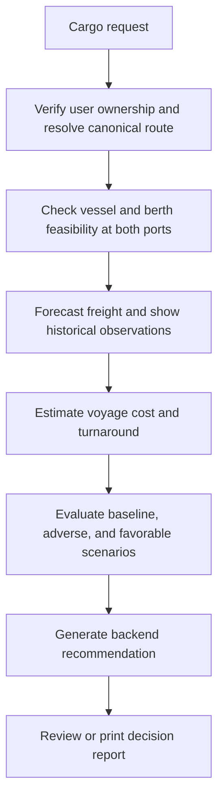
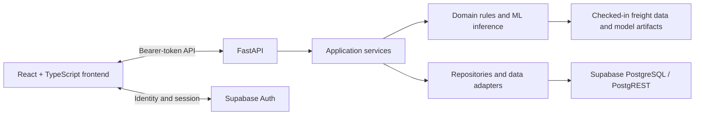

# DockTech

## Intelligent Freight Forecasting & Vessel Chartering Decision Support System

| Project detail | Value |
|---|---|
| Repository | Team-DockTech |
| Problem statement | SIH 2026, Problem Statement 26006 |
| Domain | Transportation & Logistics |
| Application | Human-reviewed decision support |

DockTech is a prototype for evaluating bulk-cargo vessel chartering decisions. It brings cargo requirements, route and vessel feasibility, freight forecasts, cost estimates, scenarios, and a backend-generated recommendation into one workflow.

The project is framed around bulk-cargo procurement to ports on India’s East Coast. Its problem statement references SAIL, but the supplied data is synthetic demonstration data and the repository does not establish that this is an official SAIL production system.

DockTech does **not** autonomously execute vessel chartering, procurement, negotiations, or bookings. It provides evidence and recommendations for human decision-makers to review.

## Problem statement

Chartering decisions combine information that is difficult to assess together: freight-rate direction, cargo delivery windows, vessel capacity, origin and destination port limits, voyage and handling time, fuel and port costs, and operational uncertainty. The PRD describes a workflow that often involves market checks, broker inputs, spreadsheets, and manual experience.

That fragmentation makes it harder to compare a feasible vessel’s cost and turnaround against its operational and market risks. A vessel that suits one port may not be able to call at the other; a parcel may require multiple voyages; and a changing delivery window can affect whether waiting is practical. DockTech aims to put those factors into a traceable decision-support workflow. It does not replace brokers or procurement approval.

## What DockTech does

The user creates or selects a cargo request, reviews reference routes and vessel options, and follows the decision workflow. The backend validates inputs and owns the calculations. The frontend displays the returned results and their assumptions.



### Workflow stages

1. **Cargo input:** The user supplies commodity, cargo volume, origin, destination, delivery window, and contract-horizon preference.
2. **Route and feasibility:** The backend resolves a canonical route and evaluates vessel/berth compatibility for the requested commodity at both origin and destination.
3. **Freight forecast:** The Forecast page displays the forecast for a supported route, vessel class, freight unit, and 7-, 30-, or 90-day horizon. Historical observations are obtained through the backend.
4. **Cost and turnaround:** The backend estimates voyage duration, handling and waiting time, required voyages, and costs using its selected inputs and units.
5. **Scenarios and risk:** Canonical baseline, adverse, and favorable cases, plus a custom evaluation, show the returned cost, turnaround, and risk results.
6. **Recommendation:** The backend combines validated forecast, feasibility, cost, and scenario evidence into a recommendation, rationale, and assumptions.
7. **Decision report:** The report presents the existing recommendation and cargo information for review and browser print/save-as-PDF.

## Core capabilities

| Capability | Current behavior | Decision value |
|---|---|---|
| Cargo requests | Authenticated users can create and retrieve cargo requests; creation is role-gated and ownership is assigned server-side. | Establishes the cargo and delivery context. |
| Reference data | Authenticated API routes expose ports, vessel classes, and routes. | Uses canonical IDs and reference records. |
| Vessel feasibility | Checks physical and commodity-compatible berth limits at both ends of the route. | Identifies infeasible vessel options with backend results. |
| Freight forecasting | Serves 7-, 30-, and 90-day forecasts with central and scenario-derived lower/upper values. | Shows an estimated trend and a range for review. |
| Historical freight | The backend exposes historical/reference freight observations for supported series. | Provides context alongside the forecast. |
| Cost and turnaround | Returns cost components, effective cost per tonne, voyage count, sailing and operational times. | Supports comparison of feasible options. |
| Scenarios and risk | Returns canonical baseline/adverse/favorable cases and supports a custom scenario evaluation. | Shows sensitivity to supplied assumptions. |
| Recommendation | Returns a recommended vessel, market-entry action, contract strategy, costs, turnaround, categorical risk/confidence, rationale, and assumptions. | Produces a traceable decision aid. |
| User access | Supabase Auth establishes identity; backend profile and route dependencies enforce application access. | Separates authentication from application authorization. |
| Decision report | Displays the existing recommendation and can use browser print/save-as-PDF. | Supports review and sharing through the user’s browser. |

## Architecture



### Layers and responsibilities

- **Frontend (`frontend/`):** React single-page application with typed API calls, workflow navigation, session handling, forms, and result presentation. It uses the Supabase client for identity/session operations and FastAPI for application workflows.
- **API (`backend/app/api/`):** FastAPI routes validate requests, require authentication, apply route-specific role gates, and delegate to services.
- **Services (`backend/app/services/`):** Coordinate cargo access, canonical route/reference resolution, forecast, feasibility, cost, scenarios, recommendations, and persistence.
- **Domain (`backend/app/domain/`):** Implements the business rules for feasibility, cost, risk/scenarios, and recommendation selection.
- **ML (`ml/`):** Contains the forecast service, features, baseline, evaluation, and training code.
- **Repositories (`backend/app/repositories/`):** Encapsulate reference and application data access. Runtime repository access uses the configured Supabase service connection; checked-in files also support seed, validation, and ML workflows.
- **Supabase:** Supabase Auth supplies identity and sessions. Supabase PostgreSQL stores application and reference records used by backend workflows.

### Architectural boundaries

- The frontend does not directly query Supabase application or reference tables.
- The backend is authoritative for input validation, domain calculations, role checks, and resource ownership checks.
- The authenticated identity comes from the verified bearer token and the corresponding application profile, not a user ID or role submitted by React.
- Supabase service-role credentials, JWT secrets, and database connection strings are backend-only. `VITE_*` values are compiled into browser-visible frontend configuration and must contain only public client configuration.

## Technology stack

| Layer | Technology | Purpose |
|---|---|---|
| Frontend | React, TypeScript, Vite | Single-page application and development/build tooling. |
| Frontend routing | React Router | Client-side page navigation. |
| Frontend identity | Supabase JavaScript client | Supabase Auth session operations. |
| Frontend presentation | CSS and Lucide icons | DockTech styling and interface icons. |
| Backend API | Python, FastAPI, Pydantic | HTTP routes, validation, and response schemas. |
| Backend HTTP access | HTTPX | Supabase Auth/PostgREST HTTP calls. |
| Token verification | PyJWT (`jwt` import) | Local configured JWT validation; alternatively the auth verifier can validate through Supabase Auth. |
| Forecasting | NumPy, Pandas, scikit-learn, joblib | Feature preparation, Ridge model artifacts, forecast inference, and evaluation. |
| Persistence and identity | Supabase Auth, PostgreSQL, PostgREST | Authentication and backend-managed application/reference data. |
| Database setup | SQL migration and Python seed script | Schema initialization and reference-data loading workflows. |

The frontend manifest declares Recharts, but the current frontend source does not import it; the README does not describe it as an active charting dependency.

## Forecasting

The model card describes a 7-day seasonal-naive baseline and a Ridge autoregression model trained separately by route, vessel class, and freight unit. Ridge features use prior observations, shifted rolling statistics, and calendar/trend inputs. Model selection compares candidates using validation MAE; the seasonal-naive model wins ties. The selected serving model is evaluated on a later chronological final-test period, which does not influence selection.

The recorded periods are:

| Period | Dates |
|---|---|
| Initial model fitting for validation | 2024-01-01 to 2025-04-30 |
| Validation and model selection | 2025-05-01 to 2025-08-31 |
| Independent final test | 2025-09-01 to 2025-12-31 |

The model card reports 336 route/vessel/unit series and a Ridge selection for all 336 based on validation. The final-test results are documented in [the model card](models/metadata/MODEL_CARD.md) and [evaluation metrics](models/metadata/evaluation_metrics.csv). These are results on the supplied synthetic dataset, not commercial performance claims.

The forecast service supports 7-, 30-, and 90-day horizons. It can use the existing seasonal-naive implementation when the selected Ridge artifact or inference fails. The displayed lower/upper forecast bounds are derived from the existing canonical scenario freight adjustments; they are scenario bounds, not statistical confidence intervals.

The ML service currently reads checked-in freight observations and model metadata/artifacts. The forecast-history API separately returns backend-sourced reference observations. These are distinct data paths.

## Feasibility, cost, risk, and recommendation

### Feasibility

The backend checks vessel dimensions and commodity compatibility against berth constraints at both ports. It does not treat cargo exceeding single-voyage capacity as an automatic rejection; required voyages are based on cargo volume and vessel cargo capacity. A vessel rejected by feasibility must not be selected by the recommendation engine.

### Cost and turnaround

The backend returns sailing, handling, waiting, turnaround, voyage count, freight, fuel and applicable port-cost information. Freight values retain the API units `USD_PER_MT` or `USD_PER_DAY`; display labels may be more user-friendly, but API/domain values remain canonical. Estimates are comparative planning outputs, not binding quotations.

### Scenarios and risk

The canonical scenarios are `BASELINE`, `ADVERSE`, and `FAVORABLE`. The scenario API also supports custom evaluations. Risk is returned as a categorical `LOW`, `MEDIUM`, or `HIGH` value using backend rules; the frontend displays these results and does not calculate risk.

### Recommendation

The recommendation engine only considers candidates with feasible backend results and validates that cargo, route, vessel, forecast, costs, and scenarios agree. It ranks candidates using effective cost per tonne, aggregate scenario risk, turnaround, required voyages, and vessel-class ID as deterministic tie-break order.

The response distinguishes:

- **Market-entry action:** `FIX_NOW` or `WAIT`.
- **Contract strategy:** `SPOT` or `SHORT_TERM_MULTIPLE_VOYAGE`.

The service records the selected vessel, expected freight and total cost, turnaround, categorical risk/confidence, rationale, assumptions, and forecast-run provenance. This is a backend recommendation for human review, not an instruction to execute a charter.

## Data architecture and provenance

The repository contains nine reference datasets described by [`data/reference/manifest.json`](data/reference/manifest.json): ports, berths, vessel classes, routes, freight rates, commodity prices, fuel prices, port activity, and scenario defaults. The manifest records the generator, generation time, date coverage, record counts, and checksums. The supplied reference records are labeled synthetic in the project’s data dictionary and provenance artifacts.

The normal application data path is:

```text
Version-controlled reference/seed artifacts
        -> validation and seed workflow
        -> Supabase PostgreSQL runtime tables
        -> backend repositories
        -> services and domain logic
        -> API response and frontend display
```

There is an important distinction: the forecast ML service uses the checked-in freight CSV and model artifacts for inference, while the historical-observation API reads reference observations through the backend. Do not interpret the synthetic forecast inputs or reference values as live market feeds.

The model card reports source data through 2025-12-31. The reference manifest records history from 2024-01-01 through 2025-12-31. The forecast artifact’s documented fit ends before its final test period. More recent market regimes are not represented by those artifacts.

## Authentication, roles, and security

1. Supabase Auth authenticates the user and maintains the browser session.
2. The frontend sends the access token as a bearer token to FastAPI.
3. The backend verifies the token, resolves the linked `user_profiles` record, and uses that profile for application role and identity.
4. FastAPI applies role checks on protected operations and ownership checks on cargo-scoped operations.

The application roles are `VIEWER`, `PLANNER`, `MANAGER`, and `ADMINISTRATOR`. New profiles default to `VIEWER`; signup does not choose a role. Cargo creation, forecast generation, recommendation creation, and scenario evaluation are restricted to the roles configured by their backend routes. Administrator-only routes support user discovery and role assignment; the backend protects those operations, including against self-role assignment. This summary is not a replacement for the route-level rules in the implementation.

The backend remains the security boundary. UI visibility is not authorization. Never put `SUPABASE_SERVICE_ROLE_KEY`, `SUPABASE_JWT_SECRET`, or `DATABASE_URL` in frontend variables or commit real credentials.

The architecture describes PostgreSQL RLS as defense in depth. This README does **not** claim that deployed/live RLS policies have been verified. Application-level FastAPI authorization and ownership checks are separate controls.

## API overview

The authoritative application mounts its API under `/api/v1`. Interactive OpenAPI documentation is available at `/docs` when the backend is running.

| Area | Example route | Purpose |
|---|---|---|
| Authentication | `POST /api/v1/auth/provision`, `GET /api/v1/auth/me` | Provision or retrieve the authenticated application profile. |
| Admin user roles | `GET /api/v1/auth/users`, `PATCH /api/v1/auth/users/{user_id}/role` | Administrator-only user discovery and role assignment. |
| Cargo | `POST /api/v1/cargo-requests`, `GET /api/v1/cargo-requests/{id}` | Create and retrieve cargo requests. |
| Reference | `GET /api/v1/ports`, `/api/v1/vessels`, `/api/v1/routes` | Retrieve canonical reference data. |
| Forecast | `GET /api/v1/forecast/history`, `POST /api/v1/forecast` | Retrieve historical observations and generate a forecast. |
| Feasibility | `POST /api/v1/feasibility` | Evaluate vessel/port feasibility. |
| Cost | `POST /api/v1/cost` | Request backend cost and operational estimates. |
| Scenarios | `GET /api/v1/scenarios/defaults`, `POST /api/v1/scenarios/run-canonical`, `POST /api/v1/scenarios/evaluate` | Retrieve defaults and evaluate scenarios. |
| Recommendation | `POST /api/v1/recommendations` | Generate the backend decision recommendation. |
| Provenance | `GET /api/v1/provenance` | Retrieve existing data-provenance metadata. |

## Repository structure

```text
backend/                 FastAPI application, services, domain, schemas, repositories
frontend/                React + TypeScript application
ml/                      Forecast features, models, inference, training, evaluation
models/                  Model artifacts and metadata/model card
data/                    Reference datasets, manifest, and provenance artifacts
scripts/                 Data generation, validation, and database seeding tools
supabase/migrations/     SQL schema migration(s)
tests/                   Backend API, service, integration, domain, and ML tests
docs/                    Project issue/QA records and decision documentation
PRD.md                   Product requirements and V1 scope
ARCHITECTURE.md          System architecture and boundaries
DATA_DICTIONARY.md       Canonical data definitions and constraints
DESIGN.md                Product visual design system
RULES.md                 Project development rules
SYNTHETIC_DATA_DESIGN.md Synthetic reference-data design
```

## Setup and installation

### Prerequisites

- Python and pip
- Node.js and npm
- Supabase project configuration for authenticated application workflows

The repository does not currently pin a Python version or declare a complete lockfile for Python dependencies.

### Clone

```bash
git clone <repository-url>
cd Team-DockTech
```

### Backend environment

Create and activate a virtual environment from the repository root:

```bash
python -m venv .venv
```

Windows PowerShell:

```powershell
.\.venv\Scripts\Activate.ps1
```

macOS/Linux:

```bash
source .venv/bin/activate
```

Install the declared requirements:

```bash
python -m pip install -r requirements.txt
```

> **Known setup note:** the current requirements file does not declare Uvicorn, used by the documented server command, or PyJWT, imported by backend token verification. A clean environment may therefore need `python -m pip install uvicorn PyJWT` before startup. These dependencies are not pinned in the repository, so this setup is not fully reproducible yet.

The backend loads settings from a root `.env` file. Copy `.env.example` to `.env` and replace placeholders with values from your Supabase project. Do not commit the resulting file.

Start the authoritative FastAPI application from the repository root:

```bash
python -m uvicorn backend.main:app --reload --port 8000
```

The API docs are served at `http://localhost:8000/docs`.

### Frontend environment and setup

Create `frontend/.env.local` with the following names and your public Supabase client configuration:

```dotenv
VITE_SUPABASE_URL=
VITE_SUPABASE_ANON_KEY=
VITE_API_BASE_URL=http://localhost:8000
```

`VITE_API_BASE_URL` is optional; the frontend defaults to `http://localhost:8000`. Vite variables are visible to browser code. Never put a service-role key, JWT secret, or database URL in this file.

Install the lockfile-defined frontend dependencies and start Vite:

```bash
cd frontend
npm ci
npm run dev
```

### Database schema and seed data

The repository contains a Supabase SQL migration under `supabase/migrations/` and a reference-data seed script at `scripts/seed_database.py`. The seed script requires `DATABASE_URL` for a direct PostgreSQL connection. Follow the project’s approved Supabase migration/seed procedure for the target database; this README does not provide a production or destructive database command.

## Environment variables

The root `.env.example` contains backend placeholders only. The frontend variables below belong in `frontend/.env.local`; Vite exposes `VITE_*` values to browser code.

### Backend

| Variable | Required? | Purpose |
|---|---|---|
| `PROJECT_NAME` | Optional | FastAPI application title; has a default. |
| `API_V1_STR` | Optional | API prefix; defaults to `/api/v1`. |
| `CORS_ORIGINS` | Optional | Comma-separated browser origins; local defaults are configured. |
| `SUPABASE_URL` | Required for Supabase-backed runtime | Project URL used by backend auth/repository access. |
| `SUPABASE_ANON_KEY` | Conditional | Used for Auth REST token verification when local JWT-secret verification is not configured. |
| `SUPABASE_SERVICE_ROLE_KEY` | Required for current backend persistence/reference access | Backend-only Supabase repository credential. Never expose to the browser. |
| `SUPABASE_JWT_SECRET` | Conditional | Backend-only local HS256 token verification secret. Never expose to the browser. |
| `DATABASE_URL` | Seed script only | Direct PostgreSQL connection used by `scripts/seed_database.py`. |
| `DOCKTECH_DATA_DIR` | Optional | Overrides the reference CSV directory for supported local/offline workflows. |
| `DOCKTECH_TIMING` | Optional | Set to `1` to enable development timing logs. |

### Frontend

| Variable | Required? | Purpose |
|---|---|---|
| `VITE_SUPABASE_URL` | Yes for frontend authentication | Public Supabase project URL used by Supabase Auth client. |
| `VITE_SUPABASE_ANON_KEY` | Yes for frontend authentication | Public/anonymous client key; not a service-role credential. |
| `VITE_API_BASE_URL` | Optional | FastAPI base URL; defaults to `http://localhost:8000`. |

Never commit `.env` or `.env.local` files. Never place service-role keys, JWT secrets, or database credentials in frontend variables. Every `VITE_*` value must be treated as visible to users of the built frontend.

## Testing and validation

Run the backend test suite from the repository root:

```bash
python -m pytest
```

The suite includes domain/unit, service, API, integration, authorization/ownership, recommendation, and ML tests. It may require a writable pytest temporary directory in some environments.

Frontend validation commands are defined in `frontend/package.json`:

```bash
cd frontend
npm run lint
npm run build
```

There is no frontend test script or established frontend test framework in the current package manifest. The project does not claim browser-based end-to-end coverage from these commands.

## Current limitations and boundaries

- Reference and model training/evaluation inputs are synthetic demonstration data; they are not live commercial freight observations or official port notices.
- The freight model card covers data through 2025-12-31 and does not establish performance in later market regimes.
- No paid broker/index/AIS live-data feed is included in the V1 scope.
- Port constraints are representative planning inputs and require validation against current port notices before operational use.
- Cost values are estimates for comparison, not binding freight quotations or charter terms.
- Forecast uncertainty bounds are scenario-derived, not statistical confidence intervals.
- The product supports human review; it does not book vessels, negotiate, publish tenders, or execute procurement.
- The repository has no documented production deployment contract. The setup here is for local development.
- No live RLS enforcement or deployment status is asserted by this README.

## Future scope from the PRD

The PRD lists wider route/port/commodity coverage, licensed market-data feeds, ERP/procurement integrations, enterprise SSO/OIDC, production-scale availability, and fleet-wide optimization as out of scope or future possibilities. These are not represented as implemented features or delivery commitments here.

## Project documentation

- [Product Requirements Document](PRD.md)
- [System Architecture](ARCHITECTURE.md)
- [Data Dictionary](DATA_DICTIONARY.md)
- [Product Design System](DESIGN.md)
- [Development Rules](RULES.md)
- [Synthetic Data Design](SYNTHETIC_DATA_DESIGN.md)
- [Backend startup notes](backend/README.md)
- [Forecast model card](models/metadata/MODEL_CARD.md)
- [Test suite notes](tests/README.md)
- [Reference data manifest](data/reference/manifest.json)

## Project context

The PRD identifies DockTech as an SIH 2026 MVP for Problem Statement 26006 in Transportation & Logistics, with a problem framing around bulk-cargo procurement for India’s East Coast. This repository is the Team-DockTech implementation. The README does not imply official deployment or endorsement by SAIL or the Ministry of Steel.

## Disclaimer

DockTech is a prototype decision-support system. Its synthetic inputs and estimates require review and validation by qualified human decision-makers; they are not chartering instructions or commercial quotations.
